# KGoT-Alita: A Next-Generation AI Agent Architecture

**Building a reliable, cost-effective, and self-evolving AI assistant that reasons with structured knowledge.**

This project introduces a novel AI agent architecture that combines the dynamic tool-generation capabilities of Alita with the structured reasoning of Knowledge Graph of Thoughts (KGoT). By addressing the core problems of unreliability and high operational costs in current AI agents, KGoT-Alita aims to deliver a robust, efficient, and scalable solution for complex reasoning tasks.

The entire system, including both the Alita and KGoT frameworks, is being implemented from scratch based on their respective research papers, integrating novel concepts like cross-validation and advanced multimodality.

---

## 🧠 Foundational Research

This project is built upon the ideas and architectures described in the following research papers:

- **Alita**: [Generalist Agent Enabling Scalable Agentic Reasoning with Minimal Predefinition and Maximal Self-Evolution](https://arxiv.org/abs/2505.20286)
- **KGoT**: [Affordable AI Assistants with Knowledge Graph of Thoughts](https://arxiv.org/pdf/2504.02670)
- **RAG-MCP**: [Retrieval-Augmented Generation for Model Context Protocols](https://arxiv.org/html/2505.03275v1) - This paper inspires our approach to cross-validated MCP generation.

---

## 🎯 Core Problem & Our Solution

Current state-of-the-art AI agents often rely on a brute-force, trial-and-error approach. They use powerful, expensive models to tackle problems, leading to high costs, frequent failures, and unreliable performance. Alita's original concept of dynamically generating tools (Model Context Protocols or MCPs) was promising, but its reliance on trial-and-error for MCP creation remained a critical bottleneck.

Our enhanced architecture solves these fundamental issues through three key innovations:

### 1. 💡 KGoT for Structured Reasoning
We integrate a **Knowledge Graph of Thoughts (KGoT)** engine to transform unstructured, chaotic information into a structured knowledge graph. This allows the agent to:
- **Build and maintain context cheaply** using structured knowledge triplets (subject, predicate, object).
- **Enable smaller, more cost-effective models** to achieve superior performance on complex reasoning tasks.
- **Achieve a 25% cost reduction** and an **18% performance improvement** on challenging GAIA Level 3 benchmarks.

### 2. ✅ Cross-Validated MCP Generation
To eliminate the unreliability of Alita's original design, we introduce a rigorous **cross-validation framework** for MCP generation. This ensures:
- A **>90% success rate** for all deployed MCPs, validated across multiple scenarios before use.
- **Quality gates** that prevent unreliable or faulty tools from entering the system.
- A **validation-driven optimization loop** that continuously improves the quality and performance of the MCP toolbox.
This transforms MCP generation from a gamble into a reliable engineering process.

### 3. 🌐 Advanced Multimodal Web Processing
The agent is equipped with a sophisticated web agent that goes beyond simple scraping, featuring:
- **HuggingFace Search Integration**: Leverages multiple providers for robust information retrieval.
- **Playwright Screenshot Analysis**: Captures and interprets visual information from web pages.
- **Visual-Spatial Reasoning**: Understands complex webpage layouts and the relationships between elements.
- **Automated Form Interaction**: Engages with web forms to gather information that is otherwise inaccessible.

---

## 🏛️ System Architecture

The KGoT-Alita architecture is designed to orchestrate these innovations into a cohesive system. The manager agent acts as the central coordinator, leveraging the KGoT engine to build a knowledge base and the cross-validation framework to generate reliable tools for executing tasks.

```mermaid
graph TD;
    subgraph "KGoT-Alita Core";
        A["User Query"] --> B{Enhanced Alita Manager};
        B --"Needs a tool"--> C[Validated MCP Generation];
        B --"Needs context"--> D[KGoT Knowledge<br/>Graph Builder];
        C --> F[Tool Execution];
        D --> E{Structured Knowledge Graph};
        E --"Provides context"--> F;
    end

    subgraph "Integrated Tools";
        direction LR
        G["Advanced Web Agent<br/>• HuggingFace Search<br/>• Playwright Screenshots<br/>• Visual Understanding"]
        H[Multimodal Processor]
        I[Code Runner & more...]
    end

    F --> G;
    F --> H;
    F --> I;
```



---

## 🚀 Project Goals & Roadmap

This project is being developed through a comprehensive 5-phase plan, meticulously designed to build, integrate, and productionize the KGoT-Alita agent.

### Core Objectives:
- **Performance**: Achieve an **18% improvement** on GAIA Level 3 reasoning tasks over baseline models.
- **Cost Efficiency**: Reduce operational costs by **25%**.
- **Reliability**: Ensure a **>90% success rate** for all generated MCPs.

### High-Level Roadmap:
- **Phase 1: Foundation & Implementation from Research Papers**: Implement the core Alita and KGoT architectures from scratch, setting up the foundational modules for MCP creation, knowledge graph storage, and error management.
- **Phase 2: Advanced Integration & Cross-Validation**: Build the cross-validation engine, integrate sequential thinking for advanced reasoning, and develop the core high-value MCPs.
- **Phase 3: Production Integration & Advanced Reasoning**: Focus on scalability, advanced query processing, and intelligent MCP orchestration to handle complex, real-world tasks.
- **Phase 4: Advanced Features & Production Optimization**: Implement the unified system controller, disaster recovery, and advanced monitoring to ensure the system is production-ready.
- **Phase 5: Advanced RAG-MCP & Ecosystem Enhancement**: Build an autonomous, self-improving MCP ecosystem and a next-generation framework for future growth.

For a complete breakdown of all tasks, see the detailed implementation plans in the `/docs` directory.

---

### 🚧 Current Status: In Progress
**The project is actively under development and is currently halfway through Phase 3.**

I  successfully laid the foundational architecture, including the core components of both Alita and KGoT, and implemented the initial cross-validation framework. Our current focus is on production integration, advanced reasoning strategies, and optimizing the system for scalability and performance.

---

## 📂 Repository Structure

The project is organized into a modular architecture to support its complex, multi-faceted nature.

```
kgot_alita/
├── alita-kgot-enhanced/
│   ├── alita_core/         # Core Alita agent: manager, MCP creation, etc.
│   ├── kgot_core/          # Core KGoT engine: controller, graph store, tools.
│   ├── mcp_toolbox/        # Library of validated, reusable MCPs.
│   ├── multimodal/         # Tools for visual and cross-modal processing.
│   ├── validation/         # The MCP cross-validation and performance testing framework.
│   ├── orchestration/      # Intelligent workflow and MCP orchestration.
│   └── ...                 # Other core modules.
├── docs/                   # Detailed technical specifications and implementation plans.
├── knowledge-graph-of-thoughts/ # Original KGoT research code (submodule)
└── ...
```

---

## 🏁 Getting Started

This is a complex system involving multiple services and technologies. To get started, refer to the following:
- The `docker-compose.yml` files located in `alita-kgot-enhanced/config/containers/` and `knowledge-graph-of-thoughts/containers/`.
- The setup scripts in `alita-kgot-enhanced/scripts/setup/`.
- The detailed implementation plans in the `docs/` folder.

---

## 🤝 Contributing

This is an ambitious project aiming to redefine the standards for AI agents. Contributions are welcome! If you are interested in contributing, please review the implementation plans in the `docs/` directory to understand the ongoing work and future roadmap. Feel free to open an issue to discuss potential contributions.
