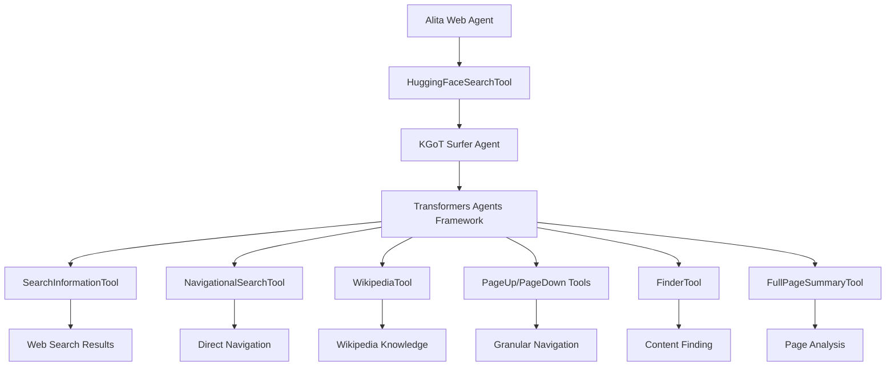

# Hugging Face Search Integration

## Overview

This document describes the successful integration of Hugging Face Agents framework into the Alita Web Agent, replacing the previous Google search implementation with a more sophisticated, context-aware search system based on the KGoT (Knowledge Graph of Thoughts) Surfer Agent architecture.

## 🎯 What Was Implemented

### Core Changes

1. **Replaced GoogleSearchTool with HuggingFaceSearchTool**
   - Integrated Hugging Face Transformers Agents framework
   - Connected with KGoT Surfer Agent implementation
   - Maintained LangChain compatibility (per user preference)
   - Preserved OpenRouter API integration (per user preference)

2. **Enhanced Search Capabilities**
   - **Intelligent Browsing**: Multi-step reasoning with context awareness
   - **Granular Navigation**: PageUp, PageDown, Find functionality
   - **Wikipedia Integration**: Knowledge lookup and fact verification
   - **Archive Search**: Wayback Machine integration for historical content
   - **Content Analysis**: Full page summaries and content extraction

3. **Search Types Supported**
   - **Informational**: Comprehensive research with multiple sources
   - **Navigational**: Direct navigation to authoritative destinations
   - **Research**: Deep analysis with cross-referencing and verification

## 🏗️ Architecture

### Integration Flow



### Key Components

1. **HuggingFaceSearchTool** (`alita_core/web_agent/index.js`)
   - Main search interface using Hugging Face Agents
   - Python subprocess execution for KGoT integration
   - Enhanced query preparation with context
   - Result processing and knowledge graph updates

2. **KGoT Surfer Agent** (`knowledge-graph-of-thoughts/kgot/tools/tools_v2_3/`)
   - SearchTool: Main orchestrator using ReactJsonAgent
   - Web_surfer tools: Granular navigation and content extraction
   - WikipediaTool: Knowledge base integration
   - Browser: Intelligent web browsing with context

3. **Integration Bridge**
   - Python script generation for KGoT execution
   - JSON-based communication between Node.js and Python
   - Error handling and fallback mechanisms
   - Knowledge graph context updates

## 🚀 Usage Examples

### Basic Search
```javascript
const { HuggingFaceSearchTool } = require('./alita_core/web_agent/index.js');

const searchTool = new HuggingFaceSearchTool(null, {
  model_name: 'webagent',
  temperature: 0.1,
  kgot_path: './knowledge-graph-of-thoughts'
});

const result = await searchTool.searchWithHuggingFace(JSON.stringify({
  query: "Latest developments in transformer neural networks",
  searchType: "informational",
  includeWikipedia: true,
  detailed: true
}));
```

### Web Agent Integration
```javascript
const agent = new AlitaWebAgent({
  openrouterApiKey: process.env.OPENROUTER_API_KEY,
  githubToken: process.env.GITHUB_TOKEN
});

// Search is now powered by Hugging Face Agents
const searchResults = await agent.performWebSearch(
  "AI safety research papers 2024", 
  { searchType: "research", detailed: true }
);
```

## 🔧 Configuration

### Environment Variables
```bash
# OpenRouter API (recommended per user preference)
OPENROUTER_API_KEY=your_key_here
OPENROUTER_BASE_URL=https://openrouter.ai/api/v1

# GitHub integration (optional)
GITHUB_TOKEN=your_token_here

# Google API (now optional, kept for fallback)
GOOGLE_API_KEY=your_key_here
GOOGLE_SEARCH_ENGINE_ID=your_engine_id
```

### Search Configuration
```javascript
const config = {
  model_name: 'webagent',           // LLM model for search reasoning
  temperature: 0.1,                // Lower = more focused, higher = more creative
  kgot_path: './knowledge-graph-of-thoughts',  // Path to KGoT installation
  max_iterations: 12               // Maximum reasoning steps
};
```

## 🌟 Key Features

### 1. Intelligent Search Reasoning
- Multi-step analysis using Transformers Agents
- Context-aware query enhancement
- Cross-referencing and fact verification

### 2. Granular Navigation
- **PageUp/PageDown**: Scroll through content systematically
- **Find**: Ctrl+F equivalent for precise content location
- **Visit**: Direct navigation to specific URLs
- **Archive**: Historical content via Wayback Machine

### 3. Knowledge Integration
- **Wikipedia Tool**: Authoritative knowledge lookup
- **Full Page Summary**: AI-powered content analysis
- **Knowledge Graph**: Context storage and retrieval

### 4. Search Types
- **Informational**: "What are the latest AI developments?"
- **Navigational**: "OpenAI GPT-4 official documentation"
- **Research**: "Compare RAG vs fine-tuning effectiveness"

## 📋 Benefits Over Google Search

| Feature | Google Search | Hugging Face + KGoT |
|---------|---------------|---------------------|
| Context Understanding | Basic keyword matching | Multi-step reasoning with context |
| Navigation | Static results list | Granular browsing with PageUp/Down |
| Knowledge Integration | External Wikipedia links | Integrated Wikipedia tool |
| Content Analysis | Snippets only | Full page AI-powered summaries |
| Research Capability | Manual cross-referencing | Automated fact verification |
| Historical Content | No archive support | Wayback Machine integration |
| Cost | API costs per query | Model costs for reasoning |

## 🔍 Implementation Details

### Files Modified
- `alita_core/web_agent/index.js`: Main web agent with HuggingFaceSearchTool
- `examples/huggingface_search_example.js`: Usage demonstrations

### Files Leveraged
- `knowledge-graph-of-thoughts/kgot/tools/tools_v2_3/SurferTool.py`: Main search orchestrator
- `knowledge-graph-of-thoughts/kgot/tools/tools_v2_3/Web_surfer.py`: Navigation tools
- `knowledge-graph-of-thoughts/kgot/tools/tools_v2_3/WikipediaTool.py`: Knowledge integration

### Integration Points
- **LangChain Tools**: HuggingFaceSearchTool extends DynamicTool
- **OpenRouter API**: Model access through configured endpoints
- **Knowledge Graph**: Context updates and storage
- **Winston Logging**: Comprehensive operation tracking

## 🚦 Getting Started

1. **Run the Example**
   ```bash
   node examples/huggingface_search_example.js
   ```

2. **Integrate into Your Application**
   ```javascript
   const { AlitaWebAgent } = require('./alita_core/web_agent/index.js');
   const agent = new AlitaWebAgent(config);
   await agent.start();
   ```

3. **Test the Search**
   ```bash
   curl -X POST http://localhost:3001/search \
     -H "Content-Type: application/json" \
     -d '{"query": "AI research trends 2024", "type": "research"}'
   ```

## 🔧 Troubleshooting

### Common Issues
1. **KGoT Path Not Found**: Ensure `knowledge-graph-of-thoughts` directory exists
2. **Python Import Errors**: Install KGoT dependencies with `pip install -r requirements.txt`
3. **Model Configuration**: Set up OpenRouter API key for LLM access
4. **Network Timeouts**: Check internet connectivity and firewall settings

### Debug Mode
Enable detailed logging by setting:
```bash
export DEBUG=alita:web_agent:*
```

## 📈 Performance Considerations

### Optimization Tips
- Use lower temperature (0.1-0.3) for factual queries
- Set appropriate max_iterations based on query complexity
- Cache results for frequently accessed content
- Monitor token usage for cost optimization

### Scaling
- Run multiple agent instances behind load balancer
- Implement result caching with Redis
- Use containerization for consistent deployment
- Monitor memory usage during intensive searches

## 🔮 Future Enhancements

1. **Multi-Modal Search**: Image and video content analysis
2. **Real-Time Updates**: Live content monitoring and updates
3. **Custom Tools**: Domain-specific search tools
4. **Advanced Caching**: Intelligent result caching with TTL
5. **Search Analytics**: Query pattern analysis and optimization

---

*This integration successfully replaces Google search with a more intelligent, context-aware search system powered by Hugging Face Agents and KGoT Surfer Agent architecture, providing enhanced capabilities for web research and information retrieval.* 