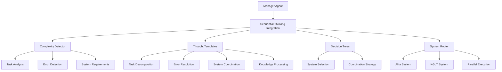
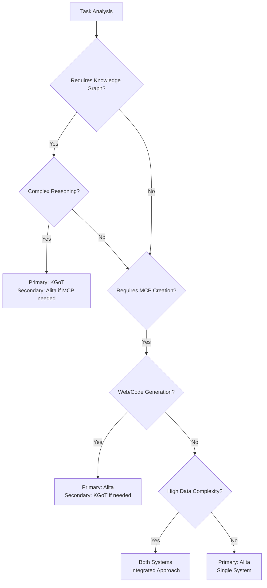
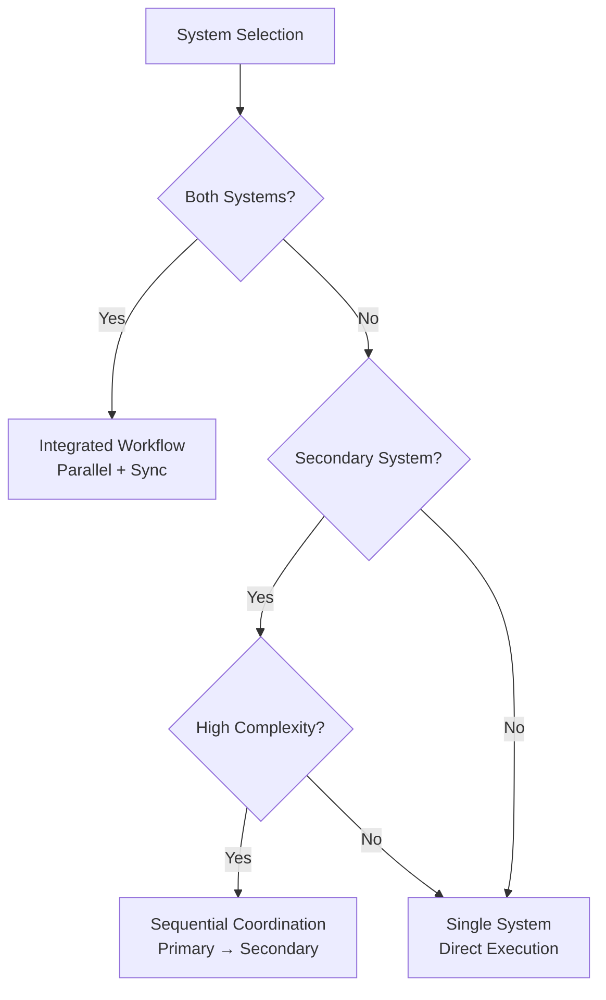

# Sequential Thinking MCP Integration

## Overview

The Sequential Thinking MCP Integration is a sophisticated reasoning engine that serves as the core intelligence layer for the Alita Manager Agent. It provides advanced complexity detection, systematic routing logic, and intelligent decision trees for coordinating between Alita MCP creation and KGoT knowledge processing systems.

## Key Features

### 🧠 Complexity Detection Triggers
- **Task Complexity Score > 7**: Automatically triggers when tasks exceed complexity thresholds
- **Multiple Errors (> 3)**: Activates for error-heavy scenarios requiring systematic resolution
- **Cross-System Coordination**: Detects when both Alita and KGoT systems are needed
- **Multi-Domain Tasks**: Identifies tasks spanning multiple knowledge domains

### 🔄 Thought Process Templates
- **Task Decomposition**: Breaks complex tasks into manageable subtasks
- **Error Resolution**: Systematically resolves multiple or cascading errors
- **System Coordination**: Coordinates operations across Alita and KGoT systems
- **Knowledge Processing**: Integrates knowledge from multiple sources

### 🎯 System Routing Intelligence
- **Decision Trees**: Intelligent routing between Alita and KGoT systems
- **Coordination Strategies**: Parallel, sequential, and integrated execution
- **Fallback Mechanisms**: Graceful degradation and error recovery

## Architecture



## Configuration

### Initialization Options

```javascript
const sequentialThinking = new SequentialThinkingIntegration({
  // Complexity detection thresholds
  complexityThreshold: 7,        // Task complexity score trigger
  errorThreshold: 3,             // Error count trigger
  maxThoughts: 15,               // Maximum reasoning steps

  // Reasoning engine configuration
  enableCrossSystemCoordination: true,  // Enable Alita-KGoT coordination
  enableAdaptiveThinking: true,         // Dynamic thought adjustment
  thoughtTimeout: 30000,               // 30 second timeout per step

  // Integration settings
  enableMCPCreationRouting: true,      // Route to MCP creation
  enableKGoTProcessing: true           // Route to KGoT processing
});
```

## Usage

### 1. LangChain Tool Integration

The Sequential Thinking integration automatically creates a LangChain tool that can be used by the Manager Agent:

```javascript
// The tool is automatically added to the agent's tools
const tools = this.createAgentTools(); // Includes sequential_thinking tool
```

### 2. Direct API Access

#### Trigger Sequential Thinking

```bash
POST /sequential-thinking
Content-Type: application/json

{
  "taskId": "task_001",
  "description": "Complex multi-system integration task",
  "requirements": [
    {
      "description": "Web scraping capability",
      "priority": "high",
      "complexity": "medium"
    },
    {
      "description": "Knowledge graph integration",
      "priority": "critical",
      "complexity": "high"
    }
  ],
  "errors": [
    {
      "type": "integration",
      "message": "System coordination failure",
      "severity": "high"
    }
  ],
  "systemsInvolved": ["Alita", "KGoT"],
  "dataTypes": ["text", "structured", "graph"],
  "interactions": [
    {
      "type": "bidirectional",
      "complexity": "high",
      "systems": ["Alita", "KGoT"]
    }
  ],
  "timeline": {
    "urgency": "high",
    "deadline": "2024-01-15T10:00:00Z"
  },
  "dependencies": ["web_agent", "mcp_creation", "knowledge_graph"]
}
```

#### Response Format

```json
{
  "status": "completed",
  "sessionId": "thinking_task_001_1703123456789",
  "complexityAnalysis": {
    "complexityScore": 9,
    "shouldTriggerSequentialThinking": true,
    "recommendedTemplate": {
      "name": "System Coordination",
      "description": "Coordinate complex operations across Alita and KGoT systems"
    }
  },
  "thinkingResult": {
    "template": "System Coordination",
    "conclusions": {
      "keyInsights": {
        "complexityAssessment": "High complexity multi-system task",
        "systemCoordination": "Multi-system coordination required",
        "recommendedActions": ["Implement proper inter-system communication"]
      },
      "overallApproach": {
        "strategy": "coordinated_multi_system",
        "primary": "coordination"
      }
    },
    "systemRecommendations": {
      "systemSelection": {
        "primary": "both",
        "coordination": "integrated"
      },
      "coordinationStrategy": {
        "strategy": "integrated_workflow",
        "execution": "parallel_with_synchronization"
      }
    }
  }
}
```

### 3. Monitoring Active Sessions

```bash
GET /sequential-thinking/sessions
```

Response:
```json
{
  "activeSessions": 2,
  "sessions": [
    {
      "sessionId": "thinking_task_001_1703123456789",
      "taskId": "task_001",
      "template": "System Coordination",
      "progress": 0.8,
      "duration": 15234,
      "status": "active"
    }
  ]
}
```

## Complexity Detection Algorithm

### Scoring Factors

| Factor | Weight | Description |
|--------|--------|-------------|
| Multi-system involvement | +3 | Tasks requiring both Alita and KGoT |
| Error count > 3 | +4 | High error scenarios |
| Data type diversity | +2 | Multiple data formats |
| Complex interactions | +3 | Bidirectional or high-complexity interactions |
| Complex requirements | +2 | Critical or high-complexity requirements |
| High dependencies | +2 | More than 5 dependencies |
| Time constraints | +1 | High urgency scenarios |

### Trigger Conditions

```javascript
const triggerConditions = {
  complexityThreshold: complexityScore > 7,
  errorThreshold: errors.length > 3,
  crossSystemRequired: systemsInvolved.length > 1,
  multiDomainTask: dataTypes.length > 3,
  cascadingErrors: errors.some(e => e.type === 'cascading'),
  integrationRequired: interactions.some(i => i.type === 'integration')
};
```

## Decision Trees

### System Selection Logic



### Coordination Strategy



## Thought Process Templates

### 1. Task Decomposition

**Triggers**: Complexity score > 7, multiple domains, unclear requirements

**Steps**:
1. Analyze overall task complexity and scope
2. Identify key domains and technologies involved
3. Break down into logical subtasks with dependencies
4. Prioritize subtasks based on criticality
5. Validate decomposition against requirements
6. Create execution plan with resource allocation

### 2. Error Resolution

**Triggers**: Error count > 3, cascading failures, system integration errors

**Steps**:
1. Categorize and prioritize all detected errors
2. Identify root causes and error propagation patterns
3. Determine symptoms vs. causes
4. Plan resolution sequence to minimize cascading effects
5. Identify required tools and system components
6. Validate resolution plan against constraints

### 3. System Coordination

**Triggers**: Cross-system required, data synchronization, workflow orchestration

**Steps**:
1. Map capabilities to appropriate systems (Alita vs KGoT)
2. Identify data flow and synchronization points
3. Plan inter-system communication and coordination
4. Design fallback strategies for system failures
5. Optimize workflow for parallel vs. sequential execution
6. Validate coordination plan against limitations

### 4. Knowledge Processing

**Triggers**: Knowledge integration, complex reasoning, multi-source analysis

**Steps**:
1. Identify and categorize available knowledge sources
2. Analyze knowledge quality and reliability
3. Design integration strategy for disparate knowledge types
4. Plan reasoning workflow for knowledge synthesis
5. Validate integrated knowledge for consistency
6. Generate actionable insights from processed knowledge

## Event System

### Events Emitted

#### `thinkingProgress`
```javascript
{
  sessionId: "thinking_task_001_1703123456789",
  progress: 0.6,
  currentThought: {
    conclusion: "Task complexity analysis: Score 9/10...",
    recommendations: ["Consider phased approach"]
  }
}
```

#### `thinkingComplete`
```javascript
{
  sessionId: "thinking_task_001_1703123456789",
  duration: 15234,
  thoughtCount: 6,
  template: {
    name: "System Coordination"
  },
  conclusions: { /* ... */ },
  systemRecommendations: { /* ... */ }
}
```

#### `systemCoordinationPlan`
```javascript
{
  sessionId: "thinking_task_001_1703123456789",
  routingRecommendations: {
    systemSelection: { primary: "both" },
    coordinationStrategy: { strategy: "integrated_workflow" }
  },
  conclusions: { /* ... */ },
  taskId: "task_001"
}
```

## Integration with Manager Agent

### Automatic Tool Creation

```javascript
// Automatically added to LangChain agent tools
const sequentialThinkingTool = this.sequentialThinking.createSequentialThinkingTool();
```

### Event Coordination

```javascript
// Listen for thinking completion
this.sequentialThinking.on('thinkingComplete', (thinkingSession) => {
  // Emit system coordination event
  this.emit('systemCoordinationPlan', {
    sessionId: thinkingSession.sessionId,
    routingRecommendations: thinkingSession.systemRecommendations,
    conclusions: thinkingSession.conclusions,
    taskId: thinkingSession.taskId
  });
});

// Execute coordination based on recommendations
this.on('systemCoordinationPlan', async (coordinationPlan) => {
  await this.executeSystemCoordination(coordinationPlan);
});
```

## Testing

### Basic Complexity Detection Test

```javascript
const taskContext = {
  taskId: "test_001",
  description: "Simple web scraping task",
  systemsInvolved: ["Alita"],
  errors: [],
  requirements: [{ priority: "medium" }],
  dataTypes: ["text"]
};

const analysis = sequentialThinking.detectComplexity(taskContext);
console.log(analysis.shouldTriggerSequentialThinking); // false
```

### Complex Multi-System Test

```javascript
const complexTaskContext = {
  taskId: "test_002",
  description: "Multi-system knowledge integration with error handling",
  systemsInvolved: ["Alita", "KGoT"],
  errors: [
    { type: "cascading", severity: "high" },
    { type: "integration", severity: "medium" },
    { type: "timeout", severity: "low" },
    { type: "validation", severity: "high" }
  ],
  requirements: [
    { priority: "critical", complexity: "high" },
    { priority: "high", complexity: "high" },
    { priority: "medium", complexity: "medium" }
  ],
  dataTypes: ["text", "structured", "graph", "multimedia"],
  interactions: [
    { type: "bidirectional", complexity: "high" },
    { type: "integration", complexity: "high" }
  ],
  dependencies: ["web_agent", "mcp_creation", "knowledge_graph", "validation", "optimization", "multimodal"]
};

const analysis = sequentialThinking.detectComplexity(complexTaskContext);
console.log(analysis.complexityScore); // Should be > 7
console.log(analysis.shouldTriggerSequentialThinking); // true
console.log(analysis.recommendedTemplate.name); // "Error Resolution" or "System Coordination"
```

## Performance Considerations

### Memory Management
- Automatic session cleanup after 1 hour
- Complexity score caching for frequent tasks
- Event listener cleanup on shutdown

### Timeouts
- Individual thought step timeout: 30 seconds
- Overall thinking process: Based on step count × timeout
- API endpoint timeout: 60 seconds

### Monitoring
- Active session tracking
- Performance metrics logging
- Error rate monitoring

## Best Practices

### 1. Task Context Structure
- Always provide `taskId` and `description`
- Include relevant `systemsInvolved` for accurate routing
- Specify `errors` array for error-heavy scenarios
- Define `requirements` with priority and complexity
- List `dataTypes` for multi-modal tasks

### 2. Error Handling
- Monitor for `SEQUENTIAL_THINKING_ERROR` log events
- Implement fallback to standard processing
- Use timeout configurations appropriate for task complexity

### 3. Performance Optimization
- Clean up sessions periodically
- Cache complexity analysis for repeated tasks
- Use appropriate complexity thresholds for your use case

### 4. Monitoring
- Track active sessions via `/sequential-thinking/sessions`
- Monitor system status via `/status` endpoint
- Set up alerts for failed thinking processes

## Troubleshooting

### Common Issues

#### Sequential Thinking Not Triggering
- Check complexity score calculation
- Verify trigger conditions are met
- Ensure proper task context structure

#### System Coordination Failures
- Check component initialization
- Verify event listener setup
- Monitor coordination step errors

#### Performance Issues
- Check active session count
- Review timeout configurations
- Monitor memory usage

### Debug Logging

Enable debug logging for detailed insights:
```javascript
// Set LOG_LEVEL=debug in environment
process.env.LOG_LEVEL = 'debug';
```

Key log operations to monitor:
- `COMPLEXITY_DETECTION`
- `SEQUENTIAL_THINKING_START`
- `THOUGHT_STEP_EXECUTION`
- `SYSTEM_COORDINATION_EXECUTION`

## Future Enhancements

### Planned Features
1. **Machine Learning Integration**: Learn from past thinking sessions
2. **Custom Template Creation**: User-defined thought process templates
3. **Real-time Collaboration**: Multi-agent thinking sessions
4. **Performance Analytics**: Detailed metrics and optimization suggestions
5. **External System Integration**: Connect to additional reasoning systems

### Extensibility Points
- Custom complexity scoring algorithms
- Additional thought process templates
- New coordination strategies
- Enhanced fallback mechanisms
- Integration with external MCP tools

## Contributing

When extending the Sequential Thinking Integration:

1. Follow the existing event-driven architecture
2. Maintain comprehensive logging for all operations
3. Include proper error handling and fallbacks
4. Add tests for new complexity detection factors
5. Update documentation for new features

## License

This Sequential Thinking MCP Integration is part of the Alita-KGoT Enhanced system and follows the same licensing terms. 