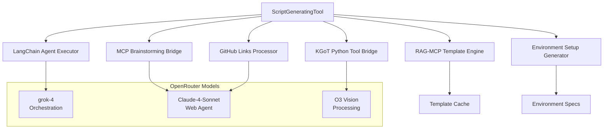

# Alita Script Generation Tool Documentation

## Overview

The **Alita Script Generation Tool** is a comprehensive AI-powered script generation system that implements Alita Section 2.3.2 "ScriptGeneratingTool" architecture with full KGoT (Knowledge Graph of Thoughts) integration. It combines advanced language models, web intelligence, and knowledge graph capabilities to generate high-quality, executable scripts with proper environment setup.

### Key Features

- **🤖 Multi-Model Orchestration**: Uses specialized models per task type (orchestration, web agent, vision)
- **🌐 Web Intelligence**: GitHub repository analysis and code extraction
- **📋 Intelligent Planning**: MCP Brainstorming for subtask decomposition
- **🧬 Knowledge Integration**: KGoT Python Code Tool for enhanced generation
- **🎯 Template Engine**: RAG-MCP template-based generation
- **⚙️ Environment Management**: Automated setup and cleanup scripts
- **🔍 LangChain Agents**: Intelligent orchestration and tool coordination

## Architecture



## Installation

### Prerequisites

- Python 3.9+
- Node.js 18+
- OpenRouter API access
- Docker (optional, for containerized execution)

### Setup

1. **Install Dependencies**:
```bash
# Python dependencies
cd alita-kgot-enhanced
pip install -r kgot_core/requirements.txt

# Node.js dependencies
npm install
```

2. **Environment Configuration**:
```bash
# Copy environment template
cp env.template .env

# Set OpenRouter API key
export OPENROUTER_API_KEY="your_openrouter_api_key_here"
```

3. **Initialize Logging**:
```bash
# Create log directories
mkdir -p logs/alita
mkdir -p logs/system
mkdir -p logs/errors
```

## Configuration

### Model Configuration (Per User Rules)

The system uses specialized models for different tasks:

```python
# Model assignments per user rules
ORCHESTRATION_MODEL = "x-ai/grok-4"    # Main reasoning & coordination
WEB_AGENT_MODEL = "anthropic/claude-4-sonnet"    # Web browsing & GitHub analysis
VISION_MODEL = "openai/o3"                       # Vision & multimodal tasks
```

### Configuration Class

```python
from alita_core.script_generator import ScriptGenerationConfig

config = ScriptGenerationConfig(
    # OpenRouter API configuration
    openrouter_api_key="your_key_here",
    openrouter_base_url="https://openrouter.ai/api/v1",
    
    # Model specialization
    orchestration_model="x-ai/grok-4",
    webagent_model="anthropic/claude-4-sonnet", 
    vision_model="openai/o3",
    
    # Integration endpoints
    mcp_brainstorming_endpoint="http://localhost:8001/api/mcp-brainstorming",
    web_agent_endpoint="http://localhost:8000/api/web-agent",
    kgot_python_tool_endpoint="http://localhost:16000/run",
    
    # Generation settings
    supported_languages=['python', 'bash', 'javascript', 'dockerfile'],
    enable_template_caching=True,
    cleanup_on_completion=True
)
```

## API Reference

### ScriptGeneratingTool

Main class for script generation operations.

#### Constructor

```python
ScriptGeneratingTool(config: Optional[ScriptGenerationConfig] = None)
```

**Parameters:**
- `config`: Configuration object (optional, uses defaults if not provided)

#### Core Methods

##### generate_script()

```python
async def generate_script(
    task_description: str,
    requirements: Optional[Dict[str, Any]] = None,
    github_urls: Optional[List[str]] = None,
    options: Optional[Dict[str, Any]] = None
) -> GeneratedScript
```

**Parameters:**
- `task_description`: High-level description of the script to generate
- `requirements`: Dictionary of requirements (language, dependencies, etc.)
- `github_urls`: List of GitHub repositories to analyze for reference
- `options`: Additional generation options

**Returns:** `GeneratedScript` object with complete script and metadata

**Example:**
```python
script = await generator.generate_script(
    task_description="Create a web scraper for e-commerce data",
    requirements={
        'language': 'python',
        'dependencies': ['requests', 'beautifulsoup4', 'pandas'],
        'output_format': 'csv',
        'error_handling': 'comprehensive'
    },
    github_urls=[
        'https://github.com/scrapy/scrapy',
        'https://github.com/requests/requests'
    ],
    options={
        'include_tests': True,
        'docker_containerize': True,
        'logging_level': 'INFO'
    }
)
```

##### get_session_stats()

```python
def get_session_stats() -> Dict[str, Any]
```

Returns session statistics including generation counts and success rates.

##### get_generation_history()

```python
def get_generation_history() -> List[Dict[str, Any]]
```

Returns history of all script generations in the current session.

### GeneratedScript Object

Complete script generation result with all components.

#### Properties

```python
class GeneratedScript:
    id: str                              # Unique script identifier
    name: str                            # Script name
    description: str                     # Script description  
    language: str                        # Programming language
    code: str                            # Generated script code
    environment_spec: EnvironmentSpec    # Environment requirements
    setup_script: str                    # Environment setup commands
    cleanup_script: str                  # Cleanup commands
    execution_instructions: str          # How to run the script
    test_cases: List[str]               # Generated test cases
    documentation: str                   # Complete documentation
    github_sources: List[GitHubLinkInfo] # Source repositories used
    created_at: datetime                 # Creation timestamp
```

### Specialized Components

#### MCP Brainstorming Bridge

Interfaces with MCP Brainstorming for task decomposition.

```python
bridge = MCPBrainstormingBridge(config)
await bridge.initialize_session("Data processing task")
subtasks = await bridge.receive_subtask_descriptions(requirements)
```

#### GitHub Links Processor

Analyzes GitHub repositories for code examples.

```python
processor = GitHubLinksProcessor(config)
links_info = await processor.process_github_links(github_urls, context)
code_snippets = await processor.extract_code_snippets(links_info, requirements)
```

#### RAG-MCP Template Engine

Template-based script generation with caching.

```python
engine = RAGMCPTemplateEngine(config)
script_code = await engine.generate_from_template('python_script', context)
```

## Usage Examples

### Basic Script Generation

```python
import asyncio
from alita_core.script_generator import ScriptGeneratingTool

async def basic_example():
    # Initialize generator
    generator = ScriptGeneratingTool()
    
    # Generate a simple data processing script
    script = await generator.generate_script(
        task_description="Process CSV files and generate summary statistics",
        requirements={'language': 'python', 'dependencies': ['pandas', 'numpy']}
    )
    
    print(f"Generated: {script.name}")
    print(f"Code length: {len(script.code)} characters")
    print(f"Setup script: {script.setup_script}")

# Run the example
asyncio.run(basic_example())
```

### Advanced GitHub Integration

```python
async def github_integration_example():
    generator = ScriptGeneratingTool()
    
    script = await generator.generate_script(
        task_description="Create a machine learning model training pipeline",
        requirements={
            'language': 'python',
            'framework': 'tensorflow',
            'data_source': 'csv',
            'model_type': 'classification'
        },
        github_urls=[
            'https://github.com/tensorflow/tensorflow',
            'https://github.com/scikit-learn/scikit-learn',
            'https://github.com/pandas-dev/pandas'
        ],
        options={
            'include_visualization': True,
            'hyperparameter_tuning': True,
            'model_evaluation': True
        }
    )
    
    # Save the generated script
    with open(f"{script.name}.py", 'w') as f:
        f.write(script.code)
    
    # Save setup script
    with open(f"setup_{script.name}.sh", 'w') as f:
        f.write(script.setup_script)
    
    print(f"✅ Generated {script.name} with {len(script.test_cases)} test cases")

asyncio.run(github_integration_example())
```

### Multi-Language Project

```python
async def multi_language_example():
    generator = ScriptGeneratingTool()
    
    # Generate Python data processor
    python_script = await generator.generate_script(
        task_description="Data preprocessing and analysis",
        requirements={'language': 'python', 'dependencies': ['pandas', 'scipy']}
    )
    
    # Generate Bash deployment script
    bash_script = await generator.generate_script(
        task_description="Deployment automation and monitoring",
        requirements={'language': 'bash', 'target_env': 'linux'}
    )
    
    # Generate Dockerfile
    docker_script = await generator.generate_script(
        task_description="Containerize the data processing pipeline",
        requirements={
            'language': 'dockerfile', 
            'base_image': 'python:3.9-slim',
            'expose_port': 8080
        }
    )
    
    print(f"Generated multi-language project:")
    print(f"- Python: {python_script.name}")
    print(f"- Bash: {bash_script.name}")
    print(f"- Docker: {docker_script.name}")

asyncio.run(multi_language_example())
```

### Custom Configuration

```python
from alita_core.script_generator import ScriptGenerationConfig, ScriptGeneratingTool

async def custom_config_example():
    # Create custom configuration
    config = ScriptGenerationConfig(
        openrouter_api_key="your_key",
        supported_languages=['python', 'javascript', 'rust'],
        template_directory="./custom_templates",
        max_script_size=2097152,  # 2MB
        execution_timeout=600     # 10 minutes
    )
    
    # Initialize with custom config
    generator = ScriptGeneratingTool(config)
    
    script = await generator.generate_script(
        task_description="High-performance data processing in Rust",
        requirements={
            'language': 'rust',
            'performance': 'high',
            'memory_safety': True,
            'concurrency': 'tokio'
        }
    )
    
    print(f"Custom Rust script: {script.name}")

asyncio.run(custom_config_example())
```

## Integration Guide

### MCP Brainstorming Integration

The tool integrates with MCP Brainstorming for intelligent task decomposition:

```javascript
// MCP Brainstorming endpoint configuration
const mcpBrainstorming = {
    endpoint: "http://localhost:8001/api/mcp-brainstorming",
    capabilities: ['task_decomposition', 'gap_analysis', 'capability_assessment']
};
```

### Web Agent Integration

Leverages Web Agent for GitHub repository analysis:

```javascript
// Web Agent configuration
const webAgent = {
    endpoint: "http://localhost:8000/api/web-agent", 
    capabilities: ['repository_analysis', 'code_extraction', 'documentation_parsing']
};
```

### KGoT Python Tool Integration

Uses KGoT for enhanced code generation:

```python
# KGoT Python Tool endpoint
KGOT_ENDPOINT = "http://localhost:16000/run"
```

### LangChain Agent Orchestration

The system uses LangChain agents with specialized tools:

```python
# Available tools in the agent
tools = [
    MCPBrainstormingTool(),      # Task decomposition
    GitHubAnalysisTool(),        # Repository analysis  
    KGoTEnhancementTool(),       # Code enhancement
    TemplateGenerationTool()     # Template-based generation
]
```

## Template System

### Built-in Templates

The RAG-MCP Template Engine includes templates for:

- **Python Scripts**: Data processing, web scraping, API clients
- **Bash Scripts**: System administration, deployment automation
- **JavaScript**: Node.js applications, Express servers
- **Dockerfiles**: Multi-stage builds, optimization
- **Environment Setup**: Virtual environments, dependency management
- **Cleanup Scripts**: Resource cleanup, log rotation

### Custom Templates

Create custom templates in the template directory:

```python
# templates/custom_template.py
"""
Custom Script Template for {{task_type}}

Generated by: Alita Script Generation Tool
Date: {{generation_date}}
Purpose: {{task_description}}
"""

import logging
{{imports}}

# Configuration
{{configuration}}

def main():
    """Main execution function"""
    logger = logging.getLogger(__name__)
    logger.info("Script execution started")
    
    {{main_logic}}
    
    logger.info("Script execution completed")

if __name__ == "__main__":
    main()
```

## Troubleshooting

### Common Issues

#### 1. Missing OpenRouter API Key

**Error**: `OPENROUTER_API_KEY not found in environment`

**Solution**:
```bash
export OPENROUTER_API_KEY="your_key_here"
```

#### 2. LLM Initialization Failed

**Error**: `Failed to initialize OpenRouter LLM`

**Solutions**:
- Verify API key validity
- Check network connectivity
- Ensure sufficient API credits

#### 3. Agent Executor Disabled

**Warning**: `LLM not available, agent executor will be disabled`

**Impact**: Limited functionality, fallback to template generation
**Solution**: Set valid OpenRouter API key

#### 4. MCP Integration Issues

**Error**: `Error in MCP Brainstorming: Connection refused`

**Solutions**:
- Start MCP Brainstorming service: `npm run start:mcp`
- Verify endpoint configuration
- Check service health

#### 5. Template Loading Failed

**Error**: `Failed to load template`

**Solutions**:
- Verify template directory exists
- Check template file permissions
- Validate template syntax

### Debug Mode

Enable detailed logging for troubleshooting:

```python
import logging
logging.basicConfig(level=logging.DEBUG)

# Enable component-specific debugging
logger = logging.getLogger('ScriptGenerator')
logger.setLevel(logging.DEBUG)
```

### Health Check

Verify system components:

```python
async def health_check():
    generator = ScriptGeneratingTool()
    
    # Check configuration
    config_ok = generator.config.openrouter_api_key is not None
    print(f"Configuration: {'✅' if config_ok else '❌'}")
    
    # Check LLM availability  
    llm_ok = generator.llm is not None
    print(f"LLM Available: {'✅' if llm_ok else '❌'}")
    
    # Check agent executor
    await generator.initialize_agent_executor()
    agent_ok = generator.agent_executor is not None
    print(f"Agent Executor: {'✅' if agent_ok else '❌'}")
    
    # Check session stats
    stats = generator.get_session_stats()
    print(f"Session ID: {stats['current_session_id']}")

asyncio.run(health_check())
```

## Performance Optimization

### Model Selection Strategy

The system automatically routes tasks to optimal models:

- **Complex reasoning**: grok-4 (orchestration)
- **Web analysis**: Claude-4-Sonnet (web agent capabilities)
- **Vision tasks**: O3 (advanced visual processing)

### Caching Strategy

- **Template caching**: Reduces generation latency
- **GitHub analysis caching**: Avoids redundant API calls
- **Session state management**: Maintains context across generations

### Parallel Processing

The system supports parallel operations:

```python
# Parallel GitHub processing
github_tasks = [
    processor.process_github_links(urls_batch_1),
    processor.process_github_links(urls_batch_2)
]
results = await asyncio.gather(*github_tasks)
```

## Security Considerations

### Code Execution Safety

- Scripts are generated but not automatically executed
- Environment validation before execution
- Sandboxed execution environment recommended

### API Key Management

- Use environment variables for API keys
- Rotate keys regularly
- Monitor API usage and costs

### Input Validation

- Task descriptions are sanitized
- GitHub URLs are validated
- Requirements are type-checked

## Contributing

### Development Setup

```bash
# Clone repository
git clone https://github.com/your-org/alita-kgot-enhanced.git
cd alita-kgot-enhanced

# Install development dependencies
npm install
pip install -r kgot_core/requirements.txt

# Run tests
npm test
python -m pytest tests/
```

### Code Style

- Follow existing patterns in `script_generator.py`
- Use JSDoc3-style comments for Python
- Maintain Winston-compatible logging
- Follow LangChain best practices

## License

MIT License - see [LICENSE](../LICENSE) file for details.

## Support

- **Documentation**: This file and inline code comments
- **Issues**: GitHub Issues tracker
- **Discussions**: GitHub Discussions
- **Email**: support@alita-kgot.dev (if available)

---

*Generated by Alita Script Generation Tool Documentation System*
*Last updated: 2025-06-28* 