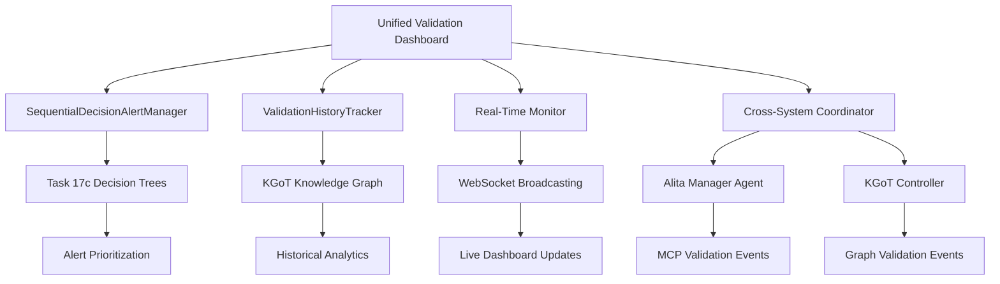

# Task 20: Unified Validation Dashboard Documentation

## Overview

The Unified Validation Dashboard represents a sophisticated monitoring and analytics system that provides real-time validation oversight across both Alita MCP and KGoT systems. This implementation integrates sequential decision trees from Task 17c to enable intelligent alert prioritization and complex validation scenario management.

### Key Capabilities

- **Real-time Validation Monitoring**: Live tracking of validation workflows across both Alita and KGoT systems
- **Sequential Decision Tree Integration**: Intelligent alert prioritization using Task 17c decision trees
- **KGoT Knowledge Persistence**: Long-term validation history storage leveraging graph analytics
- **Cross-System Analytics**: Unified metrics visualization and comparison capabilities
- **Intelligent Alert Management**: Context-aware alert prioritization with fallback strategies

## Architecture Overview

### Core Components



### Data Flow Architecture

1. **Event Collection**: Validation events from Alita MCP and KGoT systems
2. **Decision Tree Processing**: Sequential thinking for alert prioritization
3. **Knowledge Graph Storage**: Persistent storage in KGoT graph database
4. **Real-time Broadcasting**: Live updates to dashboard clients
5. **Analytics Processing**: Cross-system metrics and trend analysis

## Core Classes and Components

### 1. UnifiedValidationDashboard

**Primary orchestrator** managing all dashboard functionality and system coordination.

```python
class UnifiedValidationDashboard:
    """
    Main unified validation dashboard orchestrator
    Provides comprehensive validation monitoring across Alita MCP and KGoT systems
    """
    
    def __init__(self, config: Dict[str, Any])
    async def initialize(self) -> None
    async def start_monitoring(self) -> None
    async def get_dashboard_summary(self) -> ValidationSummary
```

**Key Features:**
- Cross-system integration with both Alita and KGoT
- Real-time event processing with async/await patterns
- Comprehensive error handling and recovery
- Performance metrics tracking and optimization

### 2. SequentialDecisionAlertManager

**Intelligent alert prioritization** using Task 17c sequential decision trees.

```python
class SequentialDecisionAlertManager:
    """
    Alert manager using sequential decision trees for intelligent prioritization
    Integrates with Task 17c decision tree implementation
    """
    
    async def initialize_decision_tree(self) -> None
    async def prioritize_alert(self, validation_event: ValidationEvent) -> AlertPriority
```

**Decision Tree Integration:**
- Creates `DecisionContext` from validation events
- Uses `SystemSelectionDecisionTree` for prioritization logic
- Maps decision confidence and costs to alert priorities
- Implements fallback prioritization for system failures

**Alert Priority Mapping:**
```python
def _map_decision_to_priority(self, decision_path, validation_event) -> AlertPriority:
    """Map decision tree results to alert priority levels"""
    confidence = decision_path.confidence_score
    system_type = decision_path.final_decision.get('system_type')
    
    # High confidence in fallback systems indicates serious issues
    if system_type == SystemType.FALLBACK and confidence > 0.8:
        return AlertPriority.CRITICAL
    
    # Cross-system validation issues are high priority
    if validation_event.event_type == ValidationEventType.CROSS_SYSTEM_VALIDATION:
        return AlertPriority.HIGH
```

### 3. ValidationHistoryTracker

**KGoT knowledge persistence integration** for long-term validation analytics.

```python
class ValidationHistoryTracker:
    """
    Validation history tracking leveraging KGoT Section 2.1 knowledge persistence
    """
    
    async def track_validation_event(self, validation_event: ValidationEvent) -> None
    async def get_validation_history(self, system: Optional[str], hours: int) -> List[ValidationEvent]
    def get_system_metrics_summary(self, system: str) -> Dict[str, float]
```

**Knowledge Graph Integration:**
- Stores validation events as graph nodes with relationships
- Creates temporal relationships between validation events
- Enables complex graph queries for trend analysis
- Supports cross-system validation pattern recognition

**Graph Node Structure:**
```python
validation_node = {
    'id': validation_event.event_id,
    'type': 'ValidationEvent',
    'event_type': validation_event.event_type.value,
    'source_system': validation_event.source_system,
    'timestamp': validation_event.timestamp.isoformat(),
    'metrics': {
        'consistency_score': metrics.consistency_score,
        'error_rate': metrics.error_rate,
        'performance_score': metrics.execution_time_avg,
        'accuracy': metrics.ground_truth_accuracy
    }
}
```

## Data Models

### ValidationEvent

**Core data structure** representing validation events from either system.

```python
@dataclass
class ValidationEvent:
    """
    Unified validation event from either Alita MCP or KGoT systems
    """
    event_id: str
    event_type: ValidationEventType
    source_system: str
    timestamp: datetime
    validation_id: str
    metrics: Optional[ValidationMetrics] = None
    metadata: Dict[str, Any] = field(default_factory=dict)
    alert_priority: Optional[AlertPriority] = None
```

### ValidationEventType Enumeration

```python
class ValidationEventType(Enum):
    """Types of validation events in the unified dashboard"""
    MCP_VALIDATION_START = "mcp_validation_start"
    MCP_VALIDATION_COMPLETE = "mcp_validation_complete"
    MCP_VALIDATION_FAILED = "mcp_validation_failed"
    KGOT_VALIDATION_START = "kgot_validation_start"
    KGOT_VALIDATION_COMPLETE = "kgot_validation_complete"
    KGOT_VALIDATION_FAILED = "kgot_validation_failed"
    CROSS_SYSTEM_VALIDATION = "cross_system_validation"
    ALERT_GENERATED = "alert_generated"
    SYSTEM_STATUS_CHANGE = "system_status_change"
```

### DashboardContext

**Configuration container** for dashboard behavior and system connections.

```python
@dataclass
class DashboardContext:
    """
    Overall dashboard context and configuration
    """
    dashboard_id: str
    monitoring_systems: List[str] = field(default_factory=lambda: ["alita", "kgot"])
    real_time_enabled: bool = True
    alert_thresholds: Dict[str, float] = field(default_factory=dict)
    validation_history_limit: int = 1000
    kgot_graph_config: Dict[str, Any] = field(default_factory=dict)
    sequential_decision_config: Dict[str, Any] = field(default_factory=dict)
```

## Integration Points

### Sequential Decision Trees (Task 17c)

The dashboard leverages the sophisticated decision tree system for intelligent validation scenario analysis:

```python
# Decision context creation from validation events
context = DecisionContext(
    task_id=validation_event.validation_id,
    task_description=f"Alert prioritization for {validation_event.event_type.value}",
    task_type="alert_prioritization",
    complexity_level=self._assess_event_complexity(validation_event),
    metadata=validation_event.metadata
)

# Decision tree traversal for alert prioritization
decision_path = await self.decision_tree.traverse_tree(context)
priority = self._map_decision_to_priority(decision_path, validation_event)
```

**Complexity Assessment Logic:**
- Failed validations → `TaskComplexity.COMPLEX`
- Cross-system validations → `TaskComplexity.CRITICAL`
- High error rates → `TaskComplexity.COMPLEX`
- Standard operations → `TaskComplexity.MODERATE`

### KGoT Knowledge Graph Integration

**Graph-based analytics** enable sophisticated validation pattern analysis:

```python
# Validation event persistence
await self.kg_interface.store_node(validation_node)

# System relationship creation
relationship = {
    'source': validation_event.source_system,
    'target': validation_event.event_id,
    'type': 'GENERATED_VALIDATION_EVENT',
    'timestamp': validation_event.timestamp.isoformat()
}
await self.kg_interface.store_relationship(relationship)
```

**Analytics Capabilities:**
- Temporal validation pattern analysis
- Cross-system correlation identification
- Performance trend visualization
- Failure mode pattern recognition

### Alita Manager Agent Connection

Integration with Alita Section 2.1 Manager Agent for MCP validation monitoring:

- Real-time MCP validation event streaming
- MCP performance metrics collection
- Tool execution validation tracking
- Manager agent decision correlation

### KGoT Controller Integration

Connection to KGoT Section 2.2 Controller for graph validation analytics:

- Graph reasoning validation monitoring
- Knowledge extraction quality assessment
- Controller orchestration performance tracking
- Graph operation success rate monitoring

## Real-Time Monitoring System

### Event Processing Pipeline

```python
async def _handle_validation_event(self, event_data: Dict[str, Any]) -> None:
    """Handle incoming validation event from either system"""
    # 1. Create validation event object
    validation_event = ValidationEvent(...)
    
    # 2. Prioritize alert using sequential decision trees
    priority = await self.alert_manager.prioritize_alert(validation_event)
    validation_event.alert_priority = priority
    
    # 3. Track in history with KGoT persistence
    await self.history_tracker.track_validation_event(validation_event)
    
    # 4. Queue for real-time processing
    await self.event_queue.put(validation_event)
    
    # 5. Update dashboard metrics
    self.dashboard_metrics['events_processed'] += 1
```

### WebSocket Broadcasting

**Real-time dashboard updates** through WebSocket connections:

```python
async def _broadcast_event_to_clients(self, event: ValidationEvent) -> None:
    """Broadcast validation event to connected WebSocket clients"""
    event_data = {
        'type': 'validation_event',
        'data': asdict(event)
    }
    
    message = json.dumps(event_data)
    
    # Send to all connected clients
    for client in self.websocket_clients:
        await client.send(message)
```

### System Status Monitoring

Continuous health checking of both Alita and KGoT systems:

```python
# System status enumeration
class SystemStatus(Enum):
    OPERATIONAL = "operational"
    DEGRADED = "degraded"
    OFFLINE = "offline"
    MAINTENANCE = "maintenance"
    ERROR = "error"

# Periodic status updates
async def _update_system_status(self) -> None:
    """Periodically update system status"""
    alita_status = await self._check_alita_status()
    kgot_status = await self._check_kgot_status()
    
    self.system_status.update({
        'alita': alita_status,
        'kgot': kgot_status
    })
```

## Winston Logging Integration

**Comprehensive structured logging** following project standards:

```python
# Component-specific logger initialization
logger = logging.getLogger('UnifiedValidationDashboard')
handler = logging.FileHandler('./logs/validation/combined.log')
formatter = logging.Formatter('%(asctime)s — %(name)s — %(levelname)s — %(funcName)s:%(lineno)d — %(message)s')

# Operation-specific logging with metadata
logger.info("Alert prioritized", extra={
    'operation': 'ALERT_PRIORITIZATION',
    'component': 'ALERT_MANAGER',
    'event_id': validation_event.event_id,
    'priority': priority.value,
    'source_system': validation_event.source_system
})
```

**Log Categories:**
- `DASHBOARD_INIT`: Dashboard initialization events
- `ALERT_PRIORITIZATION`: Decision tree-based alert processing
- `VALIDATION_EVENT_HANDLED`: Event processing tracking
- `KG_PERSISTENCE`: Knowledge graph operations
- `SYSTEM_STATUS_UPDATE`: Health check results
- `MONITORING_ERROR`: Error conditions and recovery

## Configuration

### Dashboard Configuration

```python
config = {
    'dashboard_context': {
        'monitoring_systems': ['alita', 'kgot'],
        'real_time_enabled': True,
        'validation_history_limit': 1000,
        'alert_thresholds': {
            'error_rate': 0.05,
            'performance_degradation': 0.2,
            'consistency_threshold': 0.8
        }
    },
    'validation_config': {
        'k_value': 5,
        'significance_level': 0.05,
        'cross_validation_enabled': True
    },
    'kgot_config': {
        'graph_backend': 'neo4j',
        'connection_url': 'bolt://localhost:7687',
        'database': 'validation_analytics'
    },
    'sequential_decision_config': {
        'confidence_threshold': 0.7,
        'cost_optimization_enabled': True,
        'fallback_strategies_enabled': True
    }
}
```

### Environment Variables

```bash
# Dashboard Configuration
DASHBOARD_LOG_LEVEL=INFO
DASHBOARD_REAL_TIME_ENABLED=true
DASHBOARD_HISTORY_LIMIT=1000

# KGoT Integration
KGOT_GRAPH_URL=bolt://localhost:7687
KGOT_GRAPH_USER=neo4j
KGOT_GRAPH_PASSWORD=password

# Alita Integration
ALITA_MANAGER_ENDPOINT=http://localhost:8080
ALITA_MCP_VALIDATION_ENDPOINT=http://localhost:8081

# Sequential Decision Trees
DECISION_TREE_CONFIDENCE_THRESHOLD=0.7
DECISION_TREE_COST_OPTIMIZATION=true
```

## Usage Examples

### Basic Dashboard Initialization

```python
from validation.unified_validation_dashboard import UnifiedValidationDashboard

# Initialize dashboard with configuration
dashboard = UnifiedValidationDashboard(config)
await dashboard.initialize()

# Start real-time monitoring
await dashboard.start_monitoring()
```

### Programmatic Event Injection

```python
# Create validation event
validation_event = ValidationEvent(
    event_id=str(uuid.uuid4()),
    event_type=ValidationEventType.MCP_VALIDATION_COMPLETE,
    source_system="alita",
    timestamp=datetime.now(),
    validation_id="val_12345",
    metadata={'mcp_type': 'data_processing', 'success_rate': 0.95}
)

# Process event through dashboard
await dashboard._handle_validation_event(asdict(validation_event))
```

### Dashboard Summary Retrieval

```python
# Get comprehensive dashboard summary
summary = await dashboard.get_dashboard_summary()

print(f"Total Validations: {summary.total_validations}")
print(f"Success Rate: {summary.successful_validations / summary.total_validations}")
print(f"System Reliability: {summary.system_reliability}")
print(f"Alert Summary: {summary.alert_summary}")
```

### Historical Analytics Query

```python
# Get validation history for specific system
alita_history = await dashboard.history_tracker.get_validation_history(
    system="alita", 
    hours=24
)

# Get system metrics summary
metrics_summary = dashboard.history_tracker.get_system_metrics_summary("alita")
print(f"Average Consistency: {metrics_summary['consistency_avg']}")
print(f"Average Performance: {metrics_summary['performance_avg']}")
```

## Performance Considerations

### Async/Await Optimization

- **Non-blocking Operations**: All I/O operations use async/await patterns
- **Concurrent Processing**: Multiple validation streams processed simultaneously
- **Queue Management**: Event queue prevents blocking on high-volume events

### Memory Management

```python
# Bounded collections for memory efficiency
self.validation_history = deque(maxlen=max_history)
self.alert_history = deque(maxlen=100)

# Periodic cleanup of old data
async def _cleanup_old_data(self) -> None:
    """Cleanup old validation data periodically"""
    cutoff_time = datetime.now() - timedelta(hours=24)
    # Remove old events and trigger KG cleanup
```

### Scalability Features

- **Horizontal Scaling**: Multiple dashboard instances with load balancing
- **Database Sharding**: KGoT graph partitioning for large datasets
- **Caching Strategy**: Redis integration for frequently accessed metrics
- **Connection Pooling**: Efficient database connection management

## Error Handling and Recovery

### Graceful Degradation

```python
async def prioritize_alert(self, validation_event: ValidationEvent) -> AlertPriority:
    """Use sequential decision trees with fallback prioritization"""
    try:
        # Primary: Use decision tree for prioritization
        if self.decision_tree:
            decision_path = await self.decision_tree.traverse_tree(context)
            return self._map_decision_to_priority(decision_path, validation_event)
        else:
            # Fallback: Rule-based prioritization
            return self._fallback_prioritization(validation_event)
    except Exception as e:
        logger.error(f"Alert prioritization failed: {e}")
        return AlertPriority.MEDIUM  # Safe default
```

### System Recovery Strategies

- **Circuit Breaker Pattern**: Automatic isolation of failing systems
- **Retry Mechanisms**: Exponential backoff for transient failures
- **Health Check Recovery**: Automatic reconnection when systems recover
- **Data Consistency**: Transaction-based updates for critical operations

## Deployment Architecture

### Container Deployment

```dockerfile
# Dockerfile for dashboard deployment
FROM python:3.11-slim

WORKDIR /app
COPY requirements.txt .
RUN pip install -r requirements.txt

COPY validation/ ./validation/
COPY config/ ./config/
COPY alita_core/ ./alita_core/
COPY kgot_core/ ./kgot_core/

EXPOSE 8080 8081
CMD ["python", "-m", "validation.unified_validation_dashboard"]
```

### Docker Compose Integration

```yaml
version: '3.8'
services:
  validation-dashboard:
    build: .
    ports:
      - "8080:8080"  # HTTP API
      - "8081:8081"  # WebSocket
    environment:
      - DASHBOARD_LOG_LEVEL=INFO
      - KGOT_GRAPH_URL=bolt://neo4j:7687
    depends_on:
      - neo4j
      - redis
    volumes:
      - ./logs:/app/logs
      - ./config:/app/config

  neo4j:
    image: neo4j:5.0
    environment:
      - NEO4J_AUTH=neo4j/password
    ports:
      - "7474:7474"
      - "7687:7687"
    volumes:
      - neo4j_data:/data

  redis:
    image: redis:7-alpine
    ports:
      - "6379:6379"
    volumes:
      - redis_data:/data

volumes:
  neo4j_data:
  redis_data:
```

### Kubernetes Deployment

```yaml
apiVersion: apps/v1
kind: Deployment
metadata:
  name: validation-dashboard
spec:
  replicas: 2
  selector:
    matchLabels:
      app: validation-dashboard
  template:
    metadata:
      labels:
        app: validation-dashboard
    spec:
      containers:
      - name: dashboard
        image: alita-kgot/validation-dashboard:latest
        ports:
        - containerPort: 8080
        - containerPort: 8081
        env:
        - name: KGOT_GRAPH_URL
          value: "bolt://neo4j-service:7687"
        - name: DASHBOARD_LOG_LEVEL
          value: "INFO"
        resources:
          requests:
            memory: "512Mi"
            cpu: "250m"
          limits:
            memory: "1Gi"
            cpu: "500m"
        livenessProbe:
          httpGet:
            path: /health
            port: 8080
          initialDelaySeconds: 30
          periodSeconds: 10
        readinessProbe:
          httpGet:
            path: /ready
            port: 8080
          initialDelaySeconds: 5
          periodSeconds: 5
---
apiVersion: v1
kind: Service
metadata:
  name: validation-dashboard-service
spec:
  selector:
    app: validation-dashboard
  ports:
  - name: http
    port: 8080
    targetPort: 8080
  - name: websocket
    port: 8081
    targetPort: 8081
  type: LoadBalancer
```

## Monitoring and Observability

### Prometheus Metrics

```python
# Custom metrics for dashboard monitoring
from prometheus_client import Counter, Histogram, Gauge

dashboard_events_total = Counter('dashboard_events_total', 'Total validation events processed', ['source_system', 'event_type'])
dashboard_alerts_total = Counter('dashboard_alerts_total', 'Total alerts generated', ['priority', 'source_system'])
dashboard_response_time = Histogram('dashboard_response_time_seconds', 'Response time for dashboard operations', ['operation'])
dashboard_active_validations = Gauge('dashboard_active_validations', 'Number of active validation sessions')
dashboard_system_status = Gauge('dashboard_system_status', 'System status (1=operational, 0=error)', ['system'])

# Metrics collection
dashboard_events_total.labels(source_system='alita', event_type='validation_complete').inc()
dashboard_alerts_total.labels(priority='high', source_system='kgot').inc()
dashboard_response_time.labels(operation='event_processing').observe(processing_time)
```

### Grafana Dashboard

Pre-configured Grafana dashboard configuration:

```json
{
  "dashboard": {
    "title": "Unified Validation Dashboard",
    "panels": [
      {
        "title": "Validation Event Rate",
        "type": "stat",
        "targets": [
          {
            "expr": "rate(dashboard_events_total[5m])",
            "legendFormat": "{{source_system}} - {{event_type}}"
          }
        ]
      },
      {
        "title": "System Reliability",
        "type": "graph",
        "targets": [
          {
            "expr": "dashboard_system_status",
            "legendFormat": "{{system}}"
          }
        ]
      },
      {
        "title": "Alert Priority Distribution",
        "type": "piechart",
        "targets": [
          {
            "expr": "sum by (priority) (dashboard_alerts_total)",
            "legendFormat": "{{priority}}"
          }
        ]
      }
    ]
  }
}
```

## Security Considerations

### Authentication and Authorization

```python
# JWT-based authentication for dashboard access
from functools import wraps
import jwt

def require_auth(f):
    @wraps(f)
    async def decorated_function(*args, **kwargs):
        token = request.headers.get('Authorization')
        if not token:
            return {"error": "Authorization header missing"}, 401
        
        try:
            # Remove 'Bearer ' prefix
            token = token.replace('Bearer ', '')
            payload = jwt.decode(token, SECRET_KEY, algorithms=['HS256'])
            
            # Check user permissions
            if not has_dashboard_access(payload.get('user_id')):
                return {"error": "Insufficient permissions"}, 403
                
        except jwt.InvalidTokenError:
            return {"error": "Invalid token"}, 401
            
        return await f(*args, **kwargs)
    return decorated_function

@require_auth
async def get_dashboard_summary():
    """Protected endpoint for dashboard summary"""
    pass
```

### Data Protection

- **Encryption at Rest**: Validation data encrypted in KGoT graph database
- **Transport Security**: TLS encryption for all API communications
- **Access Control**: Role-based access to validation metrics
- **Data Anonymization**: PII removal from validation events
- **Audit Logging**: Complete audit trail of all dashboard access

### Network Security

```yaml
# Kubernetes NetworkPolicy for dashboard security
apiVersion: networking.k8s.io/v1
kind: NetworkPolicy
metadata:
  name: validation-dashboard-netpol
spec:
  podSelector:
    matchLabels:
      app: validation-dashboard
  policyTypes:
  - Ingress
  - Egress
  ingress:
  - from:
    - namespaceSelector:
        matchLabels:
          name: monitoring
    ports:
    - protocol: TCP
      port: 8080
  egress:
  - to:
    - namespaceSelector:
        matchLabels:
          name: database
    ports:
    - protocol: TCP
      port: 7687
```

## Testing Strategy

### Unit Tests

```python
import pytest
from unittest.mock import AsyncMock, Mock, patch
from datetime import datetime

@pytest.mark.asyncio
async def test_alert_prioritization():
    """Test sequential decision tree alert prioritization"""
    # Setup mocks
    validation_engine = AsyncMock()
    kgot_controller = Mock()
    
    # Create alert manager
    alert_manager = SequentialDecisionAlertManager(validation_engine, kgot_controller)
    await alert_manager.initialize_decision_tree()
    
    # Test event
    event = ValidationEvent(
        event_id="test_123",
        event_type=ValidationEventType.MCP_VALIDATION_FAILED,
        source_system="alita",
        timestamp=datetime.now(),
        validation_id="val_123"
    )
    
    # Test prioritization
    priority = await alert_manager.prioritize_alert(event)
    assert priority in [AlertPriority.HIGH, AlertPriority.CRITICAL]

@pytest.mark.asyncio
async def test_knowledge_graph_persistence():
    """Test KGoT knowledge graph integration"""
    # Mock knowledge graph interface
    kg_interface = AsyncMock()
    history_tracker = ValidationHistoryTracker(kg_interface, max_history=100)
    
    # Test event tracking
    event = ValidationEvent(
        event_id="test_456",
        event_type=ValidationEventType.KGOT_VALIDATION_COMPLETE,
        source_system="kgot",
        timestamp=datetime.now(),
        validation_id="val_456"
    )
    
    await history_tracker.track_validation_event(event)
    
    # Verify graph operations were called
    kg_interface.store_node.assert_called_once()
    kg_interface.store_relationship.assert_called_once()

@pytest.mark.asyncio
async def test_dashboard_initialization():
    """Test dashboard initialization with all components"""
    config = {
        'dashboard_context': {'monitoring_systems': ['alita', 'kgot']},
        'validation_config': {'k_value': 5},
        'kgot_config': {'graph_backend': 'neo4j'},
        'sequential_decision_config': {'confidence_threshold': 0.7}
    }
    
    with patch('validation.unified_validation_dashboard.MCPCrossValidationEngine'):
        with patch('validation.unified_validation_dashboard.KGoTController'):
            dashboard = UnifiedValidationDashboard(config)
            await dashboard.initialize()
            
            assert dashboard.validation_engine is not None
            assert dashboard.alert_manager is not None
            assert dashboard.history_tracker is not None
```

### Integration Tests

```python
@pytest.mark.integration
async def test_dashboard_initialization():
    """Test full dashboard initialization with real dependencies"""
    config = get_test_config()
    dashboard = UnifiedValidationDashboard(config)
    
    await dashboard.initialize()
    
    assert dashboard.validation_engine is not None
    assert dashboard.alert_manager is not None
    assert dashboard.history_tracker is not None

@pytest.mark.integration
async def test_cross_system_event_flow():
    """Test complete event flow from Alita to KGoT persistence"""
    dashboard = UnifiedValidationDashboard(get_test_config())
    await dashboard.initialize()
    
    # Simulate Alita validation event
    alita_event = {
        'event_type': 'mcp_validation_complete',
        'source_system': 'alita',
        'validation_id': 'test_val_789',
        'metadata': {'success_rate': 0.98}
    }
    
    # Process event
    await dashboard._handle_validation_event(alita_event)
    
    # Verify event was processed and stored
    history = await dashboard.history_tracker.get_validation_history(hours=1)
    assert len(history) == 1
    assert history[0].source_system == 'alita'
```

### Load Testing

```python
# Load testing with multiple concurrent validation events
import asyncio
import time

async def load_test_dashboard():
    """Simulate high-volume validation events"""
    dashboard = UnifiedValidationDashboard(config)
    await dashboard.initialize()
    
    # Generate 1000 concurrent events
    events = [create_test_event(i) for i in range(1000)]
    
    start_time = time.time()
    await asyncio.gather(*[
        dashboard._handle_validation_event(asdict(event))
        for event in events
    ])
    duration = time.time() - start_time
    
    # Performance assertions
    assert duration < 5.0  # Should process 1000 events in under 5 seconds
    assert dashboard.dashboard_metrics['events_processed'] == 1000
    
    # Memory usage check
    import psutil
    process = psutil.Process()
    memory_mb = process.memory_info().rss / 1024 / 1024
    assert memory_mb < 500  # Should use less than 500MB

def create_test_event(index: int) -> ValidationEvent:
    """Create test validation event"""
    return ValidationEvent(
        event_id=f"test_{index}",
        event_type=ValidationEventType.MCP_VALIDATION_COMPLETE,
        source_system="alita" if index % 2 == 0 else "kgot",
        timestamp=datetime.now(),
        validation_id=f"val_{index}"
    )
```

### Performance Benchmarks

```python
@pytest.mark.benchmark
def test_event_processing_benchmark(benchmark):
    """Benchmark event processing performance"""
    dashboard = UnifiedValidationDashboard(get_test_config())
    event = create_test_event(1)
    
    # Benchmark the event processing
    result = benchmark(dashboard._handle_validation_event, asdict(event))
    
    # Assert performance requirements
    assert benchmark.stats['mean'] < 0.1  # Average processing time under 100ms

@pytest.mark.benchmark
def test_alert_prioritization_benchmark(benchmark):
    """Benchmark alert prioritization performance"""
    alert_manager = SequentialDecisionAlertManager(Mock(), Mock())
    event = create_test_event(1)
    
    result = benchmark(alert_manager.prioritize_alert, event)
    
    assert benchmark.stats['mean'] < 0.05  # Under 50ms for prioritization
```

## Future Enhancements

### Machine Learning Integration

- **Predictive Analytics**: ML models for validation failure prediction
- **Anomaly Detection**: Automated identification of unusual validation patterns
- **Optimization Suggestions**: AI-driven recommendations for system improvements

```python
# Future ML integration example
from sklearn.ensemble import IsolationForest

class AnomalyDetectionEngine:
    """ML-based anomaly detection for validation patterns"""
    
    def __init__(self):
        self.model = IsolationForest(contamination=0.1)
        self.is_trained = False
    
    async def detect_anomalies(self, validation_metrics: List[Dict]) -> List[bool]:
        """Detect anomalous validation patterns"""
        if not self.is_trained:
            await self.train_model(validation_metrics)
        
        features = self._extract_features(validation_metrics)
        anomalies = self.model.predict(features)
        return [a == -1 for a in anomalies]  # -1 indicates anomaly
```

### Advanced Visualization

- **3D Graph Visualization**: Interactive 3D representation of validation relationships
- **Real-time Heatmaps**: System performance visualization with geographic distribution
- **Predictive Dashboards**: Forward-looking validation trend analysis

### Extended Integration

- **External Monitoring**: Integration with Prometheus, Grafana, and other monitoring tools
- **Notification Systems**: Slack, email, and webhook integrations for alerts
- **API Gateway**: RESTful API for external system integration

```python
# Future notification system integration
class NotificationManager:
    """Multi-channel notification system"""
    
    async def send_alert(self, alert: ValidationEvent, channels: List[str]):
        """Send alert through multiple channels"""
        tasks = []
        
        if 'slack' in channels:
            tasks.append(self._send_slack_notification(alert))
        if 'email' in channels:
            tasks.append(self._send_email_notification(alert))
        if 'webhook' in channels:
            tasks.append(self._send_webhook_notification(alert))
        
        await asyncio.gather(*tasks, return_exceptions=True)
```

## Troubleshooting

### Common Issues

**Dashboard Won't Start**
```bash
# Check dependencies
python -c "import langchain, asyncio, websockets"

# Verify configuration
python -c "import json; print(json.load(open('config.json')))"

# Check logs
tail -f logs/validation/combined.log

# Verify database connections
python -c "
from kgot_core.graph_store.kg_interface import KnowledgeGraphInterface
kg = KnowledgeGraphInterface(config)
print(await kg.test_connection())
"
```

**High Memory Usage**
```python
# Reduce history limits
config['dashboard_context']['validation_history_limit'] = 500

# Enable more aggressive cleanup
config['cleanup_interval_seconds'] = 1800

# Monitor memory usage
import psutil
process = psutil.Process()
print(f"Memory usage: {process.memory_info().rss / 1024 / 1024:.2f} MB")
```

**KGoT Connection Issues**
```bash
# Test Neo4j connection
echo "RETURN 1" | cypher-shell -u neo4j -p password

# Check network connectivity
telnet localhost 7687

# Verify authentication
python -c "
from neo4j import GraphDatabase
driver = GraphDatabase.driver('bolt://localhost:7687', auth=('neo4j', 'password'))
with driver.session() as session:
    result = session.run('RETURN 1')
    print(result.single()[0])
"
```

**WebSocket Connection Problems**
```javascript
// Test WebSocket connection from browser
const ws = new WebSocket('ws://localhost:8081');
ws.onopen = () => console.log('Connected');
ws.onmessage = (event) => console.log('Message:', event.data);
ws.onerror = (error) => console.error('Error:', error);
```

### Performance Optimization

**Event Processing Bottlenecks**
- Increase event queue size: `asyncio.Queue(maxsize=10000)`
- Add more worker processes for parallel processing
- Optimize database queries with proper indexing
- Enable connection pooling for database operations

**Memory Leaks**
```python
# Monitor object lifecycle
import gc
import tracemalloc

tracemalloc.start()

# After operations
current, peak = tracemalloc.get_traced_memory()
print(f"Current memory usage: {current / 1024 / 1024:.2f} MB")
print(f"Peak memory usage: {peak / 1024 / 1024:.2f} MB")

# Force garbage collection
gc.collect()
```

**Database Performance**
```cypher
// Neo4j optimization queries
CREATE INDEX ON :ValidationEvent(timestamp);
CREATE INDEX ON :ValidationEvent(source_system);
CREATE INDEX ON :ValidationEvent(event_type);

// Query optimization
MATCH (v:ValidationEvent)
WHERE v.timestamp > datetime() - duration('PT24H')
RETURN v
ORDER BY v.timestamp DESC
LIMIT 100;
```

### Debug Mode Configuration

```python
# Enable debug mode
config['debug'] = True
config['dashboard_context']['log_level'] = 'DEBUG'

# Add performance profiling
import cProfile
import pstats

def profile_dashboard_operation():
    """Profile dashboard operation for performance analysis"""
    profiler = cProfile.Profile()
    profiler.enable()
    
    # Run dashboard operations
    dashboard = UnifiedValidationDashboard(config)
    asyncio.run(dashboard.initialize())
    
    profiler.disable()
    stats = pstats.Stats(profiler)
    stats.sort_stats('cumulative')
    stats.print_stats(10)
```

## File Locations

```
alita-kgot-enhanced/
├── validation/
│   ├── unified_validation_dashboard.py     # Main implementation
│   ├── mcp_cross_validator.py             # Existing validation engine
│   └── requirements.txt                    # Dependencies
├── alita_core/
│   └── manager_agent/
│       └── sequential_decision_trees.py   # Task 17c integration
├── kgot_core/
│   ├── controller/
│   │   └── kgot_controller.py            # KGoT controller
│   └── graph_store/
│       └── kg_interface.py               # Graph interface
├── config/
│   └── logging/
│       └── winston_config.js             # Logging configuration
├── docs/
│   └── TASK_20_UNIFIED_VALIDATION_DASHBOARD_DOCUMENTATION.md
├── tests/
│   ├── unit/
│   │   └── test_dashboard.py             # Unit tests
│   ├── integration/
│   │   └── test_dashboard_integration.py # Integration tests
│   └── performance/
│       └── test_dashboard_load.py        # Load tests
└── deployment/
    ├── docker-compose.yml                 # Docker deployment
    ├── kubernetes/
    │   ├── deployment.yaml               # K8s deployment
    │   ├── service.yaml                  # K8s service
    │   └── configmap.yaml                # K8s configuration
    └── monitoring/
        ├── prometheus.yml                # Prometheus config
        └── grafana-dashboard.json        # Grafana dashboard
```

## Dependencies

### Core Dependencies

```txt
# LangChain for agent development
langchain>=0.1.0
langchain-openai>=0.1.0
langchain-core>=0.1.0

# Async and WebSocket support
asyncio
websockets>=11.0
aiohttp>=3.8.0

# Data processing
numpy>=1.24.0
pandas>=2.0.0

# Graph database integration
neo4j>=5.0.0
py2neo>=2021.2.3

# Monitoring and metrics
prometheus-client>=0.16.0

# Authentication and security
PyJWT>=2.6.0
cryptography>=40.0.0

# Configuration management
pydantic>=1.10.0
python-dotenv>=1.0.0

# Logging
structlog>=23.0.0
```

### Development Dependencies

```txt
# Testing
pytest>=7.0.0
pytest-asyncio>=0.21.0
pytest-mock>=3.10.0
pytest-benchmark>=4.0.0
pytest-cov>=4.0.0

# Type checking
mypy>=1.0.0
typing-extensions>=4.5.0

# Code quality
black>=23.0.0
flake8>=6.0.0
isort>=5.12.0
pre-commit>=3.0.0

# Documentation
mkdocs>=1.4.0
mkdocs-material>=9.0.0

# Performance monitoring
memory-profiler>=0.60.0
psutil>=5.9.0
```

### System Dependencies

```bash
# Required system packages
apt-get update && apt-get install -y \
    build-essential \
    python3-dev \
    libpq-dev \
    curl \
    wget

# Neo4j (if running locally)
wget -O - https://debian.neo4j.com/neotechnology.gpg.key | apt-key add -
echo 'deb https://debian.neo4j.com stable latest' > /etc/apt/sources.list.d/neo4j.list
apt-get update && apt-get install -y neo4j
```

This comprehensive implementation provides a robust foundation for unified validation monitoring with intelligent decision-making capabilities, seamlessly integrating the sequential thinking framework from Task 17c with real-time cross-system analytics.
