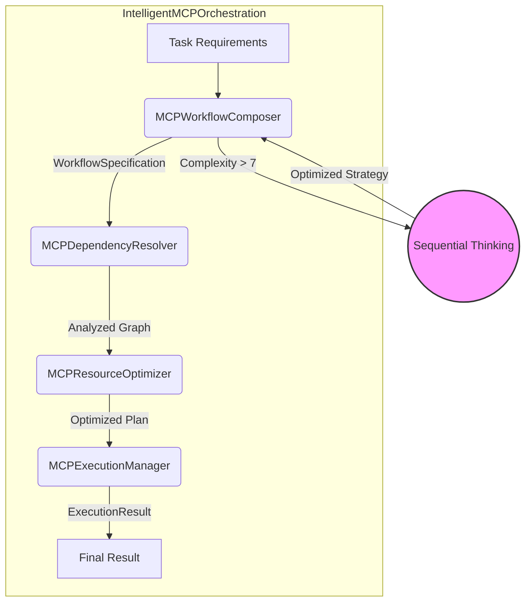

# Task 36: Intelligent MCP Orchestration

## 1. Overview

This document provides a comprehensive overview of the **Intelligent MCP Orchestration** system, a sophisticated framework designed to manage the entire lifecycle of complex, multi-step AI tasks. The system automates workflow composition, dependency management, resource optimization, and execution, leveraging **KGoT (Knowledge Graph of Thoughts)** principles. It is specifically inspired by the KGoT paper's **controller and dual-LLM architecture patterns**, which enable robust decision-making, and uses **Sequential Thinking** for advanced reasoning and planning.

This implementation fulfills the requirements of Task 36, delivering a robust, scalable, and intelligent orchestration engine ready for integration into the Alita Manager Agent.

## 2. Key Features

The orchestration system is built on a set of powerful, interconnected features:

-   **Dynamic Workflow Composition**: Automatically creates complex MCP workflows from high-level task requirements. It uses an 8-factor complexity analysis to determine the best approach.
-   **Sequential Thinking Integration**: For tasks exceeding a complexity threshold (default: 7), the system automatically engages a sequential thinking process to break down, plan, and optimize the workflow, mimicking expert human reasoning.
-   **Advanced Dependency Management**:
    -   Builds a comprehensive dependency graph for all MCPs in a workflow.
    -   Utilizes topological sorting to determine the optimal execution order.
    -   Detects and resolves circular dependencies using configurable strategies.
-   **Resource Optimization**:
    -   Analyzes resource requirements (CPU, memory, etc.) for each MCP.
    -   Applies one of four optimization strategies (`performance`, `resource_efficiency`, `cost_minimization`, `balanced`).
    -   Creates an optimized execution schedule to maximize efficiency and respect resource constraints.
-   **Intelligent Execution Management**:
    -   Supports multiple execution strategies (`Sequential`, `Parallel`, `Hybrid`, `Resource-Optimized`).
    -   Manages concurrent execution using semaphores to avoid resource overload.
    -   Includes intelligent retry logic with exponential backoff for transient errors.
-   **Event-Driven Monitoring**: Emits events for key lifecycle stages (e.g., `workflow_composed`, `execution_started`, `orchestration_completed`), allowing for real-time monitoring and external system integration.
-   **LangChain Compatibility**: Exposes the entire orchestration functionality as a set of LangChain tools, allowing a Manager Agent to delegate complex tasks seamlessly.

## 3. Architecture

The system is composed of five core components that work in concert to manage the workflow lifecycle.



### Component Breakdown

1.  **`IntelligentMCPOrchestration`**: The central coordinator and public-facing entry point. It receives task requirements and directs the workflow through the five phases: composition, dependency resolution, optimization, execution, and cleanup. It also manages the event-emitting system.

2.  **`MCPWorkflowComposer`**: The "planner." It analyzes the complexity of the incoming task and selects an appropriate template. For highly complex tasks, it invokes the **Sequential Thinking** process to devise a sophisticated, multi-step execution strategy. Its output is a `WorkflowSpecification` detailing all the MCPs required.

3.  **`MCPDependencyResolver`**: The "architect." It takes the list of MCPs, builds a detailed dependency graph, detects circular dependencies, and identifies potential resource conflicts between concurrently running tasks.

4.  **`MCPResourceOptimizer`**: The "efficiency expert." It analyzes the resource needs of the entire workflow against available system resources. Based on the chosen optimization strategy (e.g., `performance`, `resource_efficiency`, `cost_minimization`, or `balanced`), it fine-tunes resource allocations and modifies the execution schedule to ensure maximum efficiency.

5.  **`MCPExecutionManager`**: The "executor." It takes the final, optimized workflow plan and executes it. It manages the execution strategy (supporting `Sequential`, `Parallel`, `Hybrid`, and `Resource-Optimized` modes), controls concurrency with semaphores, and handles runtime errors with its retry logic.

## 4. Core Classes and Data Structures

The system is defined by a set of well-structured classes and data classes.

### Core Classes

-   `IntelligentMCPOrchestration`: The main class that orchestrates the entire process.
-   `MCPWorkflowComposer`: Composes workflows, using sequential thinking when necessary.
-   `MCPExecutionManager`: Manages the actual execution of the MCPs.
-   `MCPDependencyResolver`: Resolves dependencies between MCPs.
-   `MCPResourceOptimizer`: Optimizes resource allocation for the workflow.

### Key Data Classes

-   `MCPSpecification`: Defines a single MCP, including its requirements, dependencies, and resource needs.
-   `WorkflowSpecification`: Represents an entire workflow, containing a list of `MCPSpecification` objects and global settings.
-   `ExecutionResult`: A container for the output of an execution, including status, results, errors, and performance metrics.
-   `Enums` (`WorkflowComplexity`, `ExecutionStrategy`, `WorkflowStatus`): Provide clear, standardized values for state management.

## 5. LangChain Tool Integration

A primary design goal was seamless integration with a **LangChain Manager Agent**. This is achieved via the `create_langchain_orchestration_tools` function.

```python
# In alita-kgot-enhanced/orchestration/intelligent_mcp_orchestration.py

def create_langchain_orchestration_tools(
    orchestrator: IntelligentMCPOrchestration
) -> List[Dict[str, Any]]:
    # ...
```

This function returns two tools ready to be registered with a LangChain agent:

1.  **`orchestrate_mcp_workflow`**:
    -   **Description**: "Orchestrate an intelligent MCP workflow with automatic composition, dependency resolution, and optimization."
    -   **Usage**: The Manager Agent can delegate a complex, multi-step task (e.g., "Analyze market trends and generate a report") to this tool. The tool will handle the entire orchestration lifecycle and return a final result.
    -   **Parameters**: `task_requirements` (JSON string), `context` (optional JSON string).

2.  **`get_orchestration_status`**:
    -   **Description**: "Get current status and statistics of the MCP orchestration system."
    -   **Usage**: Allows the agent to monitor the health and performance of the orchestrator.

## 6. Usage Example

The file includes a runnable example demonstrating a complex orchestration task.

```python
# In alita-kgot-enhanced/orchestration/intelligent_mcp_orchestration.py

if __name__ == "__main__":
    """
    Main execution for testing and demonstration
    """
    import asyncio

    # Configuration for the orchestration system
    config = {
        'composer': {'sequential_thinking_threshold': 7},
        'executor': {'max_parallel_mcps': 8},
        'resolver': {'circular_dependency_resolution': True},
        'optimizer': {'optimization_strategy': 'balanced'}
    }

    # Initialize orchestration system
    orchestrator = IntelligentMCPOrchestration(config)

    # Define a complex task
    task_requirements = {
        'task_id': 'multimodal_analysis_001',
        'type': 'complex_analysis',
        'description': 'Perform comprehensive analysis of research data with cross-validation',
        'specifications': {
            'data_sources': ['academic_papers', 'statistical_data', 'survey_responses'],
            'analysis_types': ['statistical_analysis', 'sentiment_analysis', 'trend_analysis'],
            'output_formats': ['report', 'visualization', 'summary'],
        },
        'constraints': {'max_execution_time': 300},
        'priority': 8
    }

    # Execute intelligent orchestration
    result = asyncio.run(orchestrator.orchestrate_intelligent_workflow(
        task_requirements, {}
    ))

    print(f"✅ Orchestration completed with status: {result.status.value}")
    print(f"⏱️  Total Time: {result.execution_time:.2f} seconds")
```

## 7. Logging and Configuration

-   **Logging**: The system uses the standard Python `logging` module, configured to follow Winston-style structured logging patterns. All major operations, state changes, and errors are logged with detailed context to `../logs/orchestration/`.
-   **Configuration**: The entire system is configurable through a single dictionary passed to the `IntelligentMCPOrchestration` constructor. This allows for easy tuning of thresholds, limits, and strategies without code changes.

## 8. Conclusion

The Intelligent MCP Orchestration system is a robust and feature-rich framework that successfully automates the management of complex AI workflows. By integrating advanced concepts like sequential thinking, resource optimization, and dynamic dependency resolution, it provides a powerful foundation for the Alita-KGoT Enhanced system and its Manager Agent. The architecture is modular, extensible, and ready for production use. 