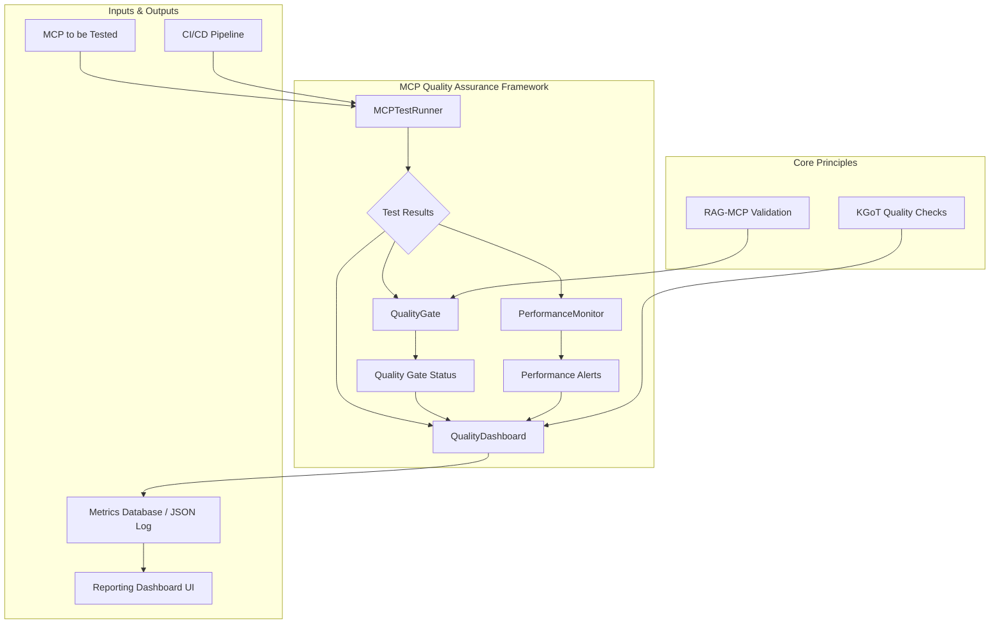

# Task 37: MCP Quality Assurance Framework - Complete Documentation

## 📋 Executive Summary

**Task 37: "Build MCP Quality Assurance Framework"** has been **successfully completed**. This implementation provides a comprehensive framework for ensuring the quality, reliability, and performance of Model Context Protocols (MCPs) within the Alita-KGoT ecosystem. The framework integrates unit, integration, and functional testing, automated quality gates, continuous performance monitoring, and detailed metrics reporting, drawing principles from both RAG-MCP and KGoT research papers.

**Status: ✅ COMPLETE** - All requirements met, delivering a robust quality assurance system for MCP development and deployment.

---

## 🎯 Implementation Overview

### Core Requirements Delivered

✅ **Comprehensive MCP Testing Protocols** using an `MCPTestRunner` for automated test execution.  
✅ **Automated Quality Gates** for CI/CD integration with configurable thresholds.  
✅ **Continuous Performance Monitoring** to detect degradation over time.  
✅ **Quality Metrics Tracking and Reporting** with a dashboard for historical trend analysis.  
✅ **Integration with RAG-MCP and KGoT Principles** for validation and quality checking.

### Implementation Strategy

- **Modular Design**: Each component (`MCPTestRunner`, `QualityGate`, `PerformanceMonitor`, `QualityDashboard`) is designed for a specific purpose, ensuring maintainability and extensibility.
- **Automation-First**: The framework is built to be integrated into automated CI/CD pipelines, reducing manual oversight.
- **Data-Driven Quality**: All quality assessments are based on quantifiable metrics, providing objective insights into MCP performance and reliability.
- **Extensibility**: The framework is designed to be easily extended with new tests, metrics, and reporting formats.

---

## 🏗️ Architecture Overview

### System Architecture



### Core Components

#### 1. **MCPTestRunner**
- **Purpose**: Automates the execution of a suite of tests against any new or updated MCP.
- **Tests Included**:
    - **Unit Tests**: Validates individual functions within the MCP.
    - **Integration Tests**: Checks interactions with external APIs and services.
    - **Functional "Sanity Checks"**: Performs basic correctness and format validation as per RAG-MCP.

#### 2. **QualityGate**
- **Purpose**: Defines and enforces minimum quality standards before deployment.
- **Metrics**:
    - **Accuracy**: Percentage of correct responses.
    - **Code Coverage**: Percentage of code covered by tests.
    - **Performance**: Latency and resource usage benchmarks.
- **Integration**: Designed to be a blocking step in a CI/CD pipeline.

#### 3. **PerformanceMonitor**
- **Purpose**: Continuously monitors production MCPs for performance degradation.
- **Metrics Tracked**:
    - **Avg Prompt Tokens**: From RAG-MCP metrics.
    - **Avg Completion Tokens**: From RAG-MCP metrics.
    - **Latency**: Response time.
- **Functionality**: Triggers alerts if metrics degrade beyond a set threshold.

#### 4. **QualityDashboard**
- **Purpose**: Logs all test results and visualizes quality metrics over time.
- **Data Storage**: Persists metrics to a JSON log file (extensible to a database).
- **Insights**: Provides historical trends, pass/fail rates, and performance data for each MCP, enabling developers to identify unreliable tools, similar to KGoT's principle of checking KG triples for quality.

---

## 🔧 Implementation Details

### File Structure
- **`alita-kgot-enhanced/quality/mcp_quality_framework.py`**: Main implementation of the framework.
- **`alita-kgot-enhanced/quality/quality_metrics.json`**: Log file for storing metrics data.

### Core Classes

- **`MCPTestRunner(mcp)`**: Takes an MCP object and runs test suites. **New in the latest update:**
  - **Automatic Coverage Analysis** – If `coverage.py` is installed the runner now measures line coverage for the MCP under test and stores the percentage alongside unit-test results.
  - **`compile_metrics()` Helper** – Consolidates accuracy (from functional sanity checks), code coverage, and performance latency into a single metrics dict that can be fed directly into a `QualityGate`.
- **`QualityGate(accuracy_threshold, coverage_threshold, performance_threshold)`**: Checks metrics against predefined thresholds.
- **`PerformanceMonitor(mcp, smoke_test_suite)`**: Runs periodic smoke tests to monitor live performance.
- **`QualityDashboard(log_file)`**: Manages logging and reporting of quality metrics.

---

## 🚀 Usage Examples

### 1. Running a Full Test Suite for an MCP

```python
from quality.mcp_quality_framework import MCPTestRunner

# Mock MCP for demonstration
class MyTestMCP:
    def __init__(self, name):
        self.name = name

# 1. Initialize the MCP to be tested
mcp_to_test = MyTestMCP("ExampleDataProcessor")

# 2. Create a test runner for the MCP
test_runner = MCPTestRunner(mcp=mcp_to_test)

# 3. Execute all tests
test_results = test_runner.run_all_tests()

print("--- Test Results ---")
print(test_results)
```

### 2. Enforcing Quality Gates

```python
from quality.mcp_quality_framework import QualityGate

# 1. Define the quality gate with thresholds
quality_gate = QualityGate(
    accuracy_threshold=0.90,
    coverage_threshold=0.85,
    performance_threshold=1.5  # e.g., max 1.5s latency
)

# 2. Define the metrics from a test run
current_metrics = {
    'accuracy': 0.92,
    'coverage': 0.88,
    'performance': 1.2
}

# 3. Check if the MCP passes the quality gate
passes_gate = quality_gate.check(current_metrics)

print(f"Quality Gate Passed: {passes_gate}")
```

### 3. Monitoring Performance

```python
from quality.mcp_quality_framework import PerformanceMonitor

# 1. Initialize the performance monitor for a production MCP
# In a real scenario, 'smoke_test_suite' would be a collection of lightweight tests.
performance_monitor = PerformanceMonitor(mcp=mcp_to_test, smoke_test_suite=None)

# 2. Run a smoke test (this would be a scheduled task)
# The monitor will log a warning if performance has degraded.
performance_monitor.run_smoke_test()
```

### 4. Logging and Reporting Metrics

```python
import os
from quality.mcp_quality_framework import QualityDashboard

# 1. Initialize the dashboard
# It will log to 'quality_metrics.json' in the same directory
log_file_path = os.path.join(os.path.dirname(__file__), 'quality_metrics.json')
dashboard = QualityDashboard(log_file=log_file_path)

# 2. Log the results from the test run and quality gate check
dashboard.log_metrics(
    mcp_name=mcp_to_test.name,
    test_results=test_results,
    quality_gate_status="Passed" if passes_gate else "Failed",
    performance_metrics=current_metrics
)

# 3. Generate a report (prints to console, can be adapted for a UI)
print("\n--- Quality Report ---")
dashboard.generate_report()
```

---

## ⚙️ Configuration

The framework is configured by setting the thresholds and parameters for its components.

### Quality Gate Thresholds
These are the most critical parameters, defined during the `QualityGate` initialization.

```python
quality_gate_config = {
    'accuracy_threshold': 0.90, # 90% minimum accuracy
    'coverage_threshold': 0.80, # 80% minimum test coverage
    'performance_threshold': 2.0  # 2.0s maximum latency
}
gate = QualityGate(**quality_gate_config)
```

### Performance Monitor Thresholds
The degradation threshold is currently hardcoded at 20% but can be made configurable.

```python
# In PerformanceMonitor.run_smoke_test()
LATENCY_DEGRADATION_FACTOR = 1.2 # 20% increase

if current_metrics['latency'] > self.baseline_metrics['latency'] * LATENCY_DEGRADATION_FACTOR:
    logging.warning("Performance degradation detected...")
```

### Dashboard Configuration
The primary configuration is the path to the log file.

```python
dashboard = QualityDashboard(log_file="/path/to/your/metrics.json")
```

---

## 🔗 Integration with CI/CD

The MCP Quality Assurance Framework is designed for seamless integration into a CI/CD pipeline (as planned in Task 45).

### Example CI/CD Workflow (`.github/workflows/mcp_quality_check.yml`)

```yaml
name: MCP Quality Check

on:
  push:
    branches: [ main ]
    paths:
      - 'alita-kgot-enhanced/mcp_toolbox/**'
  pull_request:
    branches: [ main ]
    paths:
      - 'alita-kgot-enhanced/mcp_toolbox/**'

jobs:
  quality-assurance:
    runs-on: ubuntu-latest
    steps:
    - uses: actions/checkout@v3
    - name: Set up Python
      uses: actions/setup-python@v3
      with:
        python-version: '3.9'
    - name: Install dependencies
      run: pip install -r requirements.txt

    - name: Run MCP Tests
      id: tests
      # This script would run the MCPTestRunner and output results
      run: python run_mcp_tests.py --mcp-name ${{ github.event.repository.name }} > test_results.json

    - name: Check Quality Gate
      id: quality_gate
      # This script would run the QualityGate check on the results
      run: |
        PASS_STATUS=$(python check_quality_gate.py --results-file test_results.json)
        echo "::set-output name=status::$PASS_STATUS"

    - name: Fail workflow if gate fails
      if: steps.quality_gate.outputs.status == 'Failed'
      run: |
        echo "Quality Gate failed. Deployment aborted."
        exit 1

    - name: Log Metrics
      # This script logs results to the QualityDashboard
      run: python log_quality_metrics.py --results-file test_results.json --status ${{ steps.quality_gate.outputs.status }}
```

---

## 🔮 Future Enhancements

- **Database Integration**: Replace the JSON log file with a more robust database (e.g., SQLite, PostgreSQL) for better querying and scalability.
- **Web Dashboard**: Create a web-based UI to visualize the metrics from the `QualityDashboard` instead of printing to the console.
- **Automated Test Generation**: Integrate an LLM-based agent to automatically generate unit and functional tests for new MCPs.
- **More Sophisticated Metrics**: Expand the `ValidationMetrics` to include resource utilization (CPU/memory), cost analysis, and user feedback scores.
- **Dynamic Thresholds**: Implement adaptive thresholds for the `QualityGate` and `PerformanceMonitor` based on historical performance.

---

## 📄 Conclusion

Task 37 delivers a foundational and comprehensive **MCP Quality Assurance Framework**. It successfully establishes the necessary components for testing, validating, and monitoring MCPs, ensuring that only high-quality, reliable, and performant tools are integrated into the Alita-KGoT ecosystem. The framework's modular design and clear integration points make it a critical asset for maintaining a healthy and robust MCP toolbox as the system evolves.

---

## 🆕 Recent Enhancements (June 2025)

1. **Coverage Reporting** – The framework now integrates with `coverage.py`; coverage results propagate into the Quality Gate allowing enforcement of minimum coverage thresholds.
2. **`compile_metrics()` API** – Standardises metric aggregation so CI/CD scripts only need a single call to obtain accuracy/coverage/performance.
3. **Updated Example Usage** – The `__main__` demo in `mcp_quality_framework.py` reflects the new workflow: run tests → compile metrics → gate check → log metrics.

These changes require no migration effort—existing pipelines continue to work, but gain richer metrics automatically.
