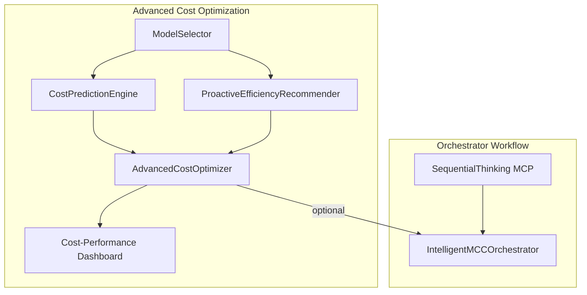

# Task 39: Advanced Cost Optimization – Documentation

## Overview
Task 39 introduces an **Advanced Cost Optimization** framework that dramatically reduces LLM-related spend while maintaining high accuracy.  
It implements the following core ideas derived from the KGoT and RAG-MCP papers:

1. **Intelligent, Multi-Model Resource Allocation** – choose the cheapest capable LLM for each step.
2. **Pre-flight Cost Prediction** – estimate workflow cost *before* execution and enforce a user-defined budget.
3. **Proactive Efficiency Recommendations** – detect prompt bloat, redundant calls, or poor tool selection and suggest fixes.
4. **Cost-Performance Dashboard** – visualise the Pareto frontier between accuracy and spend to guide engineering decisions.

The implementation lives in
`optimization/advanced_cost_optimization.py` and is now optionally plugged into the main orchestration layer (`orchestration/intelligent_mcp_orchestration.py`).

---

## Architecture


* **ModelSelector** – ranks available OpenRouter models by capability vs price and returns the cheapest model that satisfies the requested complexity score.
* **CostPredictionEngine** – walks a symbolic representation of the workflow, estimates token counts per prompt, and multiplies by model pricing to predict spend.
* **ProactiveEfficiencyRecommender** – static analysis of prompts & step order to flag wasteful patterns (e.g. using a large model for simple extraction).
* **AdvancedCostOptimizer** – convenience façade that exposes a single `optimize_and_execute()` coroutine. It bundles the selector, predictor, recommender and dashboard.
* **Cost-Performance Dashboard** – returns scatter-plot friendly data points `(cost ↔ accuracy)` for UI layers (Grafana, Streamlit, etc.).

---

## Key Classes & Methods
| Class | Location | Purpose |
|-------|----------|---------|
| `LLMClient` | `optimization/advanced_cost_optimization.py` | Wrapper around `ChatOpenAI` capturing cost per token and OpenRouter headers. |
| `ModelSelector.select_model(complexity: float)` | same | Chooses cheapest model meeting complexity requirement. |
| `CostPredictionEngine.estimate_workflow_cost(workflow)` | same | Returns dollar estimate for the supplied symbolic workflow. |
| `ProactiveEfficiencyRecommender.analyze_workflow(workflow)` | same | Returns list of human-readable optimisation tips. |
| `AdvancedCostOptimizer.optimize_and_execute(workflow, budget)` | same | Performs recommendation + cost check + (mock) execution. Returns `status`, `estimated_cost`, `recommendations`. |
| `IntelligentMCCOrchestrator.execute_task(..., budget=None)` | `orchestration` | NEW – accepts `budget` and aborts early if the optimizer predicts an overrun. |

---

## Integration Details
### Constructor Changes
```python
orchestrator = IntelligentMCCOrchestrator(
    sequential_thinking_mcp=st_mcp,
    mcp_performance_analytics=analytics,
    mcp_registry=registry,
    cost_optimizer=advanced_cost_optimizer,  # ← NEW (optional)
    default_budget=0.10  # USD
)
```
`cost_optimizer` can be omitted; the orchestrator will run exactly as before.

### Runtime Flow
1. Task prompt → `SequentialThinking MCP` → subtasks.  
2. Subtasks → execution graph (nodes/edges).  
3. **(NEW)** `_graph_to_workflow()` converts graph to a flat list for cost estimation.  
4. `AdvancedCostOptimizer.optimize_and_execute()`
   * Estimates total spend.
   * Compares against `budget` (call-time) or `default_budget` (constructor).
   * If estimate exceeds budget → returns `{status: "error"}` and orchestrator aborts with `status: "aborted", reason: "budget_exceeded"`.
   * Otherwise, cost metadata is attached to the graph for logging / downstream analytics.
5. Legacy cost-benefit analytics still run so historical metrics remain comparable.
6. Workflow executes if budget check passes.

---

## Usage Example
```python
import asyncio
from optimization.advanced_cost_optimization import AdvancedCostOptimizer, LLMClient, MCPToolSpec
from orchestration.intelligent_mcp_orchestration import IntelligentMCCOrchestrator
from langchain_openai import ChatOpenAI

# 1. Build model catalogue (lowest → highest capability)
models = {
    "claude-3-haiku": LLMClient("anthropic/claude-3-haiku", 2.5e-7, 1.25e-6, ChatOpenAI()),
    "claude-3-sonnet": LLMClient("anthropic/claude-3-sonnet", 3e-6, 1.5e-5, ChatOpenAI()),
    "claude-3-opus":  LLMClient("anthropic/claude-3-opus", 1.5e-5, 7.5e-5, ChatOpenAI()),
}

# 2. Dummy MCP registry (replace with real instances)
mcp_specs = [
    MCPToolSpec("search_engine_mcp", "Search", ["search"], 0.9, 0.95),
    MCPToolSpec("data_analysis_mcp", "Analyse", ["analysis"], 0.7, 0.98),
]

cost_optimizer = AdvancedCostOptimizer(mcp_specs, models)

# 3. Inject into orchestrator
orchestrator = IntelligentMCCOrchestrator(
    sequential_thinking_mcp=my_st_mcp,
    mcp_performance_analytics=my_analytics,
    mcp_registry=my_registry,
    cost_optimizer=cost_optimizer,
    default_budget=0.05,
)

# 4. Run with explicit (tighter) budget
result = asyncio.run(orchestrator.execute_task("Analyse quarterly sales", budget=0.02))
if result["status"] == "aborted":
    print("⚠️  Budget exceeded – suggestions:")
    for tip in result["details"]["recommendations"]:
        print(" •", tip)
else:
    print("Estimated cost:", result.get("estimated_cost"))
```

---

## Environment Variables
| Variable | Purpose |
|----------|---------|
| `OPENROUTER_API_KEY` | Required for all OpenRouter LLM calls. |
| `LOG_LEVEL` | Set to `debug` to see cost-estimation internals. |

---

## Testing
`orchestration/tests/test_cost_optimizer_integration.py` ensures that:
* The orchestrator aborts when the optimizer reports the budget would be exceeded.
* The optimizer is invoked exactly once per task.

Run all orchestrator tests:
```bash
pytest orchestration/tests -k cost_optimizer -v
```

---

## Backwards Compatibility
* All new arguments are **optional** – existing code paths continue to work.
* If `optimization/advanced_cost_optimization.py` is missing, import is sandboxed and the feature silently disables.

---

## Future Work
1. **Real Execution Feedback Loop** – feed actual token counts & spend back into the predictor for continual calibration.
2. **UI Integration** – surface the Cost-Performance Dashboard in the unified monitoring Grafana instance.
3. **Caching Layer** – memoise cost estimates for identical workflows to speed up repeated runs. 