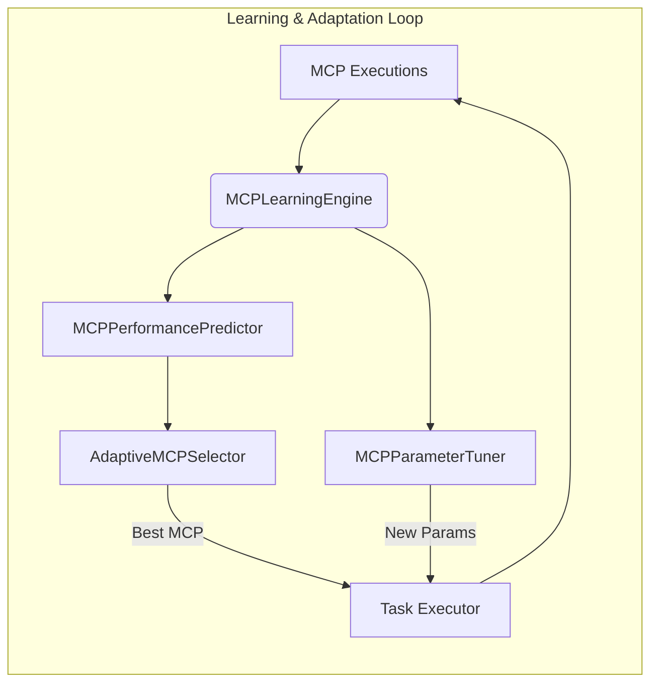
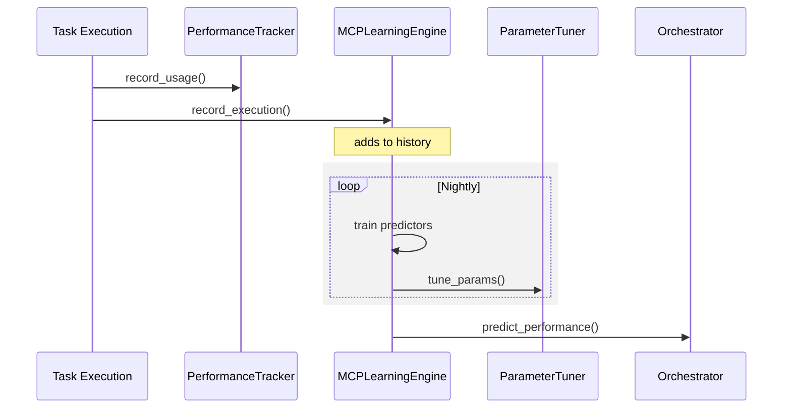

# Task 40: MCP Learning & Adaptation Engine Documentation

## 📋 Overview
The **MCP Learning & Adaptation Engine** closes the _self-evolving_ loop described in the Alita and KGoT papers.  
It continuously **records MCP executions**, **learns** from historical performance, and **adapts** future behaviour via:

1. **MCPPerformancePredictor** – estimates success-rate, latency and cost for any MCP / task.
2. **AdaptiveMCPSelector** – chooses the best MCP per task through multi-objective optimisation.
3. **MCPParameterTuner** – autonomously tweaks MCP parameters (e.g. time-outs, retries).
4. **MCPLearningEngine** – the orchestrator implementing the feedback loop.

> Result: The system improves tool selection and configuration over time with **zero manual intervention**.

---

## 🏗️ Architecture

* **Data Flow** – execution results feed the predictor → selector / tuner consume predictions → updated choices feed future executions.

---

## 🧩 Core Components
| Class | Location | Responsibility |
|-------|----------|----------------|
| `MCPPerformancePredictor` | `learning/mcp_learning_engine.py` | Train lightweight per-MCP models & predict metrics for unseen tasks |
| `AdaptiveMCPSelector` | ″ | Score candidate MCPs (`success_rate` × weight – `cost` × weight) and return the optimum |
| `MCPParameterTuner` | ″ | Detect high failure / latency patterns and update default parameters (rule-based placeholder → Optuna ready) |
| `MCPLearningEngine` | ″ | Orchestrate data recording, periodic retraining, parameter tuning & expose API hooks |

### Data Structures
```python
@dataclass
class ExecutionRecord:
    mcp_id: str
    task_complexity: float   # 0.0 – 1.0
    success: bool
    latency_ms: int
    cost: float             # USD
    timestamp: float        # UNIX epoch
    parameters: Dict[str, Any] = field(default_factory=dict)

@dataclass
class PerformancePrediction:
    success_rate: float      # 0.0 – 1.0
    latency_ms: int
    cost: float
```

---

## 🚀 Quick Start
```bash
# Run the standalone demo
python alita-kgot-enhanced/learning/mcp_learning_engine.py
```
Expected log excerpt:
```
INFO  --- Simulating Initial MCP Executions ---
INFO  --- Continuous Improvement: Retraining Models ---
INFO  --- Adaptive MCP Selection Example ---
INFO  For a complex task, the adaptive engine selected: api_client_mcp
INFO  --- Automated Parameter Tuning Example ---
INFO  Tuning web_scraper_mcp: Increasing timeout to 45.0s
INFO  --- Performance Prediction Example ---
INFO    Success Rate: 75.00% | Latency: 6 550 ms | Cost: $0.0148
```

### Programmatic Use
```python
from alita_kgot_enhanced.learning.mcp_learning_engine import MCPLearningEngine

engine = MCPLearningEngine()

# Record an execution (would normally be triggered by orchestrator)
engine.record_execution(
    ExecutionRecord(
        mcp_id="api_client_mcp",
        task_complexity=0.3,
        success=True,
        latency_ms=420,
        cost=0.0021,
        timestamp=time.time(),
    )
)

# Trigger learning cycle (nightly cron/job)
await engine.run_feedback_loop()

# Select best MCP for a new task
best = engine.selector.select_mcp(["api_client_mcp", "web_scraper_mcp"], 0.6)
print(best)  # → e.g. "api_client_mcp"
```

---

## ⚙️ Configuration Hooks
* **Weights** – `AdaptiveMCPSelector.success_weight` / `cost_weight`
* **Parameter rules** – extend `MCPParameterTuner.tune()` with Optuna / Hyperopt logic.
* **Storage** – replace in-memory `execution_history` with persistent DB (e.g. Prometheus, Postgres).
* **Scheduling** – call `run_feedback_loop()` via cron, Airflow, or within the Manager Agent at shutdown.

---

## 📊 Logging
All activities log via Python `logging` (Winston-compatible JSON wrapper recommended):
* `LEARNING_LOOP_START`, `MODEL_TRAINED`, `PARAM_TUNED`, `MCP_SELECTED`, `PREDICTION_MADE`

---

## 🔌 Integration Points
1. **Intelligent MCP Orchestrator (Task 36)** – call selector before executing sub-tasks.
2. **Performance Analytics (Task 25)** – supply richer historical metrics → predictor.
3. **Quality Assurance (Task 37)** – feed success/failure labels for more granular training.

---

## 🛣️ Future Enhancements
* Replace simple averages with **gradient-boosted models** or **online Bayesian updating**.
* Integrate **Optuna** for automatic hyper-parameter search in `MCPParameterTuner`.
* Expose REST & WebSocket endpoints for real-time prediction queries.
* Persist training data & models with **DuckDB + Parquet** for scalability.

---

## 🆕 July 2025 Enhancements
The initial prototype now includes:

1. **ML-based Performance Predictor (`mcp_performance_predictor.py`)**  
   • Gradient-Boosting models for success-probability (classification) and latency / cost (regression).  
   • Joblib persistence – models survive restarts.  
   • Feature engineering (task complexity, param stats, etc.).
2. **Real-time Prediction API**  
   • Optional FastAPI server (`create_prediction_app`) exposes `/predict`.  
   • Returns `success_rate`, `latency_ms`, `cost` for any `(mcp_id, task_complexity)` query.
3. **Adaptive Orchestrator Integration (Task 36)**  
   • `IntelligentMCCOrchestrator` now queries the predictor when multiple candidate MCPs are available and selects the best trade-off.
4. **Optuna-Powered Parameter Tuner (`mcp_parameter_tuner.py`)**  
   • Pluggable search-spaces per MCP.  
   • Multi-objective optimisation (min latency/cost, maximise success).  
   • Graceful fallback if Optuna is absent.
5. **Continuous Feedback Loop**  
   • Every execution is recorded to `MCPPerformanceTracker`.  
   • Periodic (24 h, configurable) background job retrains both naive & ML predictors.



---

## 🔑 `/predict` Endpoint
| Field | Type | Description |
|-------|------|-------------|
| `mcp_id` | str | MCP identifier (must exist in registry) |
| `task_complexity` | float | 0.0 → 1.0 difficulty score |
| `parameters` | dict | Optional parameter overrides used for feature calculation |

**Response**
```json
{
  "mcp_id": "api_client_mcp",
  "success_rate": 0.87,
  "latency_ms": 430,
  "cost": 0.0023
}
```

---

## ✅ Task Status
**Task 40 – Completed**  |  Version `1.0.0`  |  Last updated `2025-07-05` 