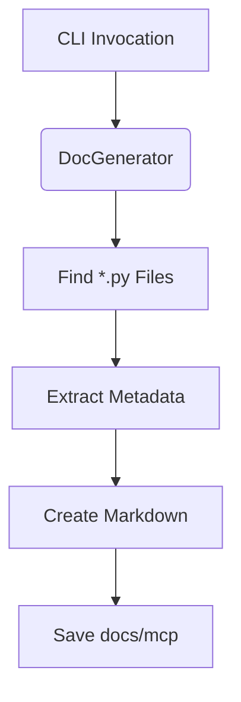

# MCP Documentation Generator

> **File Location:** `documentation/mcp_doc_generator.py`
> 
> **Task Reference:** *Task 42 – MCP Documentation Generator*

---

## 🎯 Purpose
The **MCP Documentation Generator** automates creation of Markdown docs for every **Model Context Protocol (MCP)** module by introspecting source files. It ensures docs stay in sync with code while avoiding prompt-bloat.

Key sections produced:
1. Description & intent (from docstrings)
2. Parameters (from Pydantic `args_schema`)
3. Return value semantics
4. Dependencies (from nearest `requirements.txt`)
5. Example usage snippet
6. *Best Practices* placeholder (LLM-generated in future)

---

## 🚀 Quick Start
```bash
# From repository root
python documentation/mcp_doc_generator.py \
       --source-dir alita-kgot-enhanced \
       --output-dir alita-kgot-enhanced/docs/mcp
```
Generated files appear in `alita-kgot-enhanced/docs/mcp/<mcp_name>.md` and are overwritten on subsequent runs to keep documentation fresh.

---

## 🏗️ Internal Architecture
| Component | Responsibility |
|-----------|---------------|
| `DocGenerator` | Walks the directory, extracts metadata, writes docs |
| `MCPMetadata`  | Holds extracted description, args, returns, deps |
| `_extract_metadata()` | Parses AST, locates `args_schema`, reads schema via `exec` |
| `_write_markdown()`   | Renders Markdown for each MCP |
| `_read_requirements()`| Finds nearest `requirements.txt` for dependencies |



---

## ⚙️ CLI Options
| Flag | Description | Required |
|------|-------------|----------|
| `--source-dir` | Root directory containing MCP modules | ✅ |
| `--output-dir` | Destination for generated docs (default `docs/mcp`) | ❌ |

---

## 📝 Sample Output
```markdown
# example_mcp

This MCP parses CSV files and returns summary statistics.

## Parameters
* **file_path** (*str*) – Path to CSV file
* **delimiter** (*str*) – Column separator (default `,`)

## Returns
JSON object with column stats

## Dependencies
* pandas>=2.0.0

## Example Usage
```python
from example_mcp import ExampleMCP
result = ExampleMCP().run(file_path="data.csv")
```

## Best Practices
* 🛈 *Populated automatically in a future release*
```

---

## 🧪 Testing
Run unit tests:
```bash
pytest documentation/tests -q
```
Tests cover metadata extraction and basic Markdown generation.

---

## 🔮 Future Roadmap
1. LLM-generated *Best Practices* section
2. Integration with MkDocs/Sphinx for HTML docs
3. Change-detection to regenerate only updated MCPs
4. Auto-example harvesting from tests/examples

---

© 2025 Alita-KGoT Enhanced 