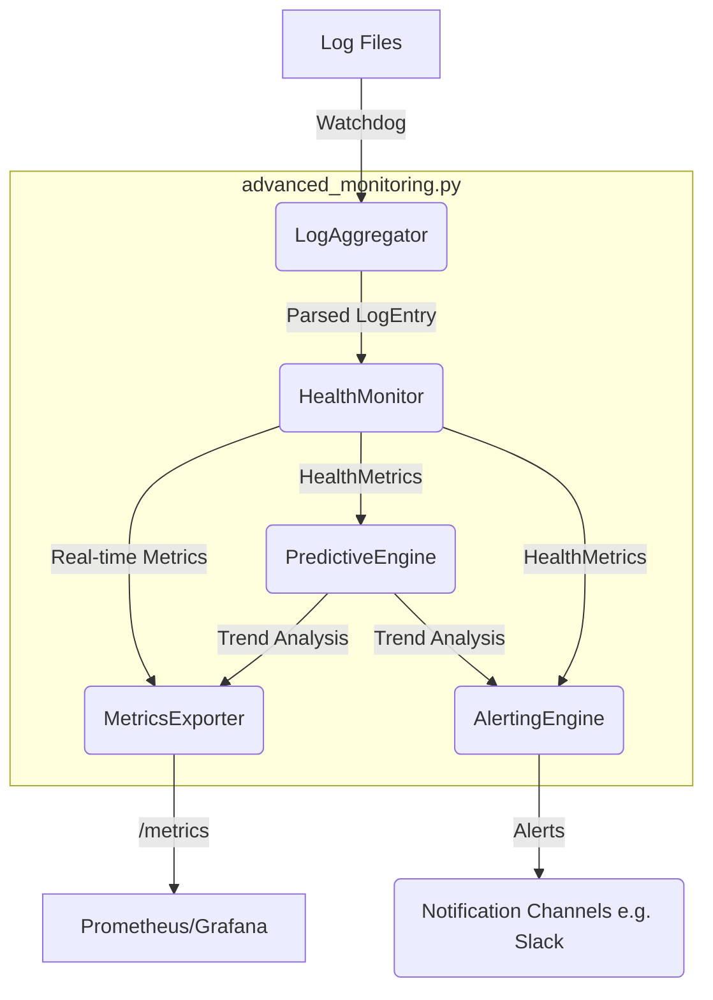

# Task 43: Advanced Monitoring and Alerting

## 1. Overview

This document details the implementation of **Task 43: Advanced Monitoring and Alerting**, a sophisticated, AI-enhanced monitoring system for the Alita-KGoT project. This system provides comprehensive health monitoring, predictive failure analysis, and intelligent, context-aware alerting, directly implementing principles from the KGoT and MCP Quality Assurance Framework papers.

The system is designed to be a centralized service that aggregates logs from all system components, analyzes them in near real-time, and provides actionable insights through alerts and a metrics dashboard interface.

## 2. Key Features

-   **Comprehensive MCP Health Monitoring**: Aggregates logs to track success/failure rates, execution latency, and API error codes for every component.
-   **Predictive Maintenance Engine**: Utilizes trend analysis on historical data to forecast potential failures, such as degrading performance or increasing error rates, before they become critical.
-   **Intelligent & Context-Aware Alerting**: A powerful, configurable rules engine triggers alerts based on complex conditions, not just simple thresholds. Alerts can be enriched with context, such as KGoT graph snapshots.
-   **Performance Forecasting & Dashboard**: Exposes a wide range of metrics, including forecasts, to a Prometheus endpoint. This allows for easy integration with visualization tools like Grafana to create detailed performance dashboards.
-   **Real-time Log Processing**: Uses `watchdog` to monitor log files for immediate processing of new entries.
-   **Configurable and Extensible**: Alerting rules, monitoring scope, and system settings are all configurable through external YAML files.

## 3. Architecture

The system is built on a modular, asynchronous architecture, with several distinct components working together.



### Component Breakdown

-   **LogAggregator**: Watches the specified log directories, reads new log lines as they are written, and parses the Winston-style JSON into a structured `LogEntry` object.
-   **HealthMonitor**: Consumes `LogEntry` objects and continuously calculates and updates `HealthMetrics` for each MCP, including counters, rates, and latency percentiles.
-   **PredictiveEngine**: Periodically queries the `HealthMonitor` for historical data, performs linear regression to identify significant trends in latency and error rates, and stores the results.
-   **AlertingEngine**: Loads alert rules from a YAML file. Periodically evaluates these rules against the latest data from the `HealthMonitor` and `PredictiveEngine` to trigger context-aware alerts.
-   **MetricsExporter**: Exposes all collected metrics (real-time health, trends, etc.) via an HTTP endpoint in a Prometheus-compatible format.

## 4. Configuration

The service is configured through a combination of environment variables and YAML files.

### `config/monitoring/alert_rules.yml`

This file defines the rules for the `AlertingEngine`.

```yaml
- name: "High Failure Rate"
  mcp_pattern: ".*" # Applies to all MCPs
  metric: "failure_rate"
  threshold: 0.20 # 20%
  window_seconds: 300 # 5 minutes
  min_failures: 3
  description: "MCP has a failure rate over 20% in the last 5 minutes."

- name: "Increasing Latency Trend"
  mcp_pattern: ".*"
  metric: "latency_trend"
  threshold: 0.5 # A positive slope
  window_seconds: 3600 # 1 hour
  description: "MCP latency is showing a significant increasing trend."
```

### Environment Variables

-   `LOG_LEVEL`: Sets the logging level for the monitoring service (e.g., `INFO`, `DEBUG`). Defaults to `INFO`.

## 5. Usage

To run the Advanced Monitoring Service:

1.  **Install Dependencies**: Ensure all required packages are installed from `requirements.txt`.
    ```bash
    pip install -r requirements.txt
    ```
2.  **Run the Service**: Execute the Python script.
    ```bash
    python alita-kgot-enhanced/monitoring/advanced_monitoring.py
    ```
3.  **Access Metrics**: The service will start an HTTP server (defaulting to port `8008`) to expose the Prometheus metrics.
    ```bash
    curl http://localhost:8008/metrics
    ```
4.  **Configure Prometheus**: Add the following scrape configuration to your `prometheus.yml` to begin collecting data:
    ```yaml
    - job_name: 'alita_monitoring'
      scrape_interval: 60s
      static_configs:
        - targets: ['localhost:8008']
    ```

## 6. Implementation Details

-   **Location**: `alita-kgot-enhanced/monitoring/advanced_monitoring.py`
-   **Dependencies**: `pandas`, `numpy`, `scikit-learn`, `pyyaml`, `watchdog`, `prometheus-client`, `statsmodels`.
-   **Logging**: Follows the project's Winston-compatible logging standards. All major operations, alerts, and errors are logged with structured context.

This system provides a robust and proactive approach to monitoring, moving beyond simple failure detection to intelligent, predictive maintenance and context-rich alerting, fulfilling the requirements of Task 43. 