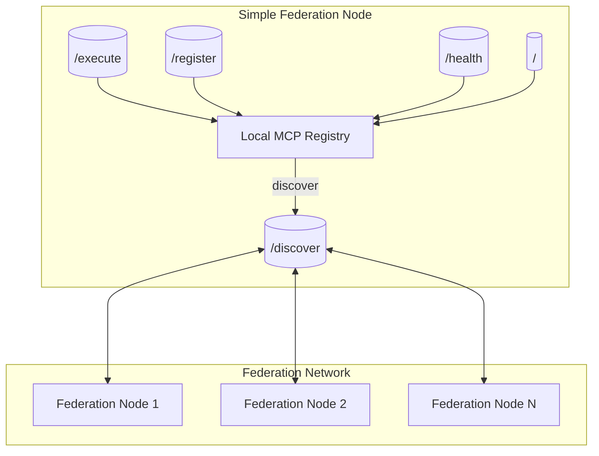

# Task 44: Simple MCP Federation System Documentation

## Overview
The **Simple MCP Federation System** provides a lightweight, local-first approach for discovering and executing Model Context Protocol (MCP) tools across multiple nodes. This system has been simplified and modernized to focus on essential federation capabilities without complex authentication or governance overhead.

Key deliverables:
1. `federation/simple_local_mcp_server.py` – FastAPI service exposing simple federation endpoints
2. `federation/simple_federated_rag_mcp_engine.py` – Engine that integrates with local federation nodes
3. Unit tests (`federation/test_simple_mcp_system.py`) validating the simple federation system

## 🔄 Migration Notice

**The original complex federation system has been replaced with a simpler, more maintainable approach.**

- ❌ **Removed**: `mcp_federation.py`, `federated_rag_mcp_engine.py`, complex authentication
- ✅ **New**: Simple local federation with minimal overhead and better developer experience
- 📁 **Backup**: Old files are preserved in `federation/backup_old_federation/`

---

## ✨ Features
| Feature | Description |
|---------|-------------|
| **Simple Endpoints** | `/`, `/health`, `/discover`, `/execute`, `/register` |
| **Local Discovery** | Lists locally available MCPs with metadata |
| **Direct Execution** | Execute MCPs directly on local nodes |
| **Dynamic Registration** | Register new MCPs at runtime |
| **Simple Engine** | `SimpleFederatedRAGMCPEngine` integrates with federation nodes |
| **No Authentication** | Simplified for development and local use |
| **Minimal Configuration** | Easy setup with sensible defaults |
| **Demo Mode** | Built-in demo data for testing and development |

---

## 🌐 API Reference

### `GET /`
Returns basic server information and status.
```json
{
  "message": "Simple MCP Federation Server",
  "mcps_available": 3
}
```

### `GET /health`
Health check endpoint.
```json
{
  "status": "healthy",
  "mcps_available": 3
}
```

### `GET /discover`
Returns array of MCP summaries available on this node.
```json
[
  {
    "name": "text_processor",
    "description": "Advanced text processing and analysis",
    "version": "1.0.0",
    "category": "text"
  }
]
```

### `POST /execute`
Executes a local MCP and returns its result.
Request body:
```json
{
  "mcp_name": "text_processor",
  "args": ["Hello World"],
  "kwargs": {"operation": "analyze"}
}
```
Successful response:
```json
{
  "result": "Text analysis complete",
  "status": "success"
}
```

### `POST /register`
Registers a new MCP with the federation node.
```json
{
  "name": "custom_tool",
  "description": "Custom processing tool",
  "version": "1.0.0",
  "category": "utility"
}
```
On success returns:
```json
{
  "status": "registered",
  "name": "custom_tool"
}
```

---

## 🏗️ Architecture


### Component Breakdown
1. **Local MCP Registry** – Simple in-memory registry containing:
   * Demo MCPs (text_processor, data_validator, file_converter)
   * Runtime registrations via `/register`
   * Toolbox MCP instances loaded from `mcp_toolbox/`
2. **Simple Federation Engine** – `SimpleFederatedRAGMCPEngine` that:
   * Connects to multiple federation nodes
   * Discovers available MCPs across the network
   * Executes MCPs on appropriate nodes
3. **No Complex Governance** – Simplified approach without heavy validation
4. **Local-First Design** – Optimized for development and local federation scenarios

---

## ⚙️ Configuration

The simple federation system requires minimal configuration:

| Environment Variable | Purpose | Default |
|----------------------|---------|----------|
| `SIMPLE_MCP_PORT` | Port for the federation server | `8080` |
| `SIMPLE_MCP_HOST` | Host for the federation server | `127.0.0.1` |

No authentication tokens or complex configuration required!

Example usage:
```bash
# Start with default settings
python federation/start_simple_server.py

# Start with demo data
python federation/start_simple_server.py --demo

# Start on custom port
SIMPLE_MCP_PORT=9000 python federation/start_simple_server.py
```

---

## 🚀 Quick Start
```bash
# 1. Start a simple federation server with demo data
cd alita-kgot-enhanced
python federation/start_simple_server.py --demo

# 2. Discover tools from the server
python - <<'PY'
from federation.simple_local_mcp_server import simple_discover
print(simple_discover('http://127.0.0.1:8080'))
PY

# 3. Use Simple Federated RAG-MCP Engine
python - <<'PY'
from federation.simple_federated_rag_mcp_engine import create_simple_federated_engine
engine = create_simple_federated_engine(
    federation_nodes=['http://127.0.0.1:8080']
)
print(f"Total MCPs available: {len(engine.get_available_mcps())}")
PY

# 4. Execute an MCP
python - <<'PY'
from federation.simple_local_mcp_server import simple_execute
result = simple_execute(
    'http://127.0.0.1:8080',
    'text_processor',
    args=['Hello World'],
    kwargs={'operation': 'analyze'}
)
print(result)
PY
```

---

## 🧪 Testing
Run the simple federation test suite:
```bash
cd alita-kgot-enhanced
python federation/test_simple_mcp_system.py --unit
```
Tests cover:
* Simple server endpoints (health, discover, execute, register)
* Federation engine integration
* MCP discovery and execution
* Integration between components

---

## 📈 Future Enhancements
1. **Multi-Node Discovery** - Automatic discovery of federation nodes
2. **Load Balancing** - Distribute MCP execution across nodes
3. **Caching Layer** - Cache MCP results for better performance
4. **Monitoring Dashboard** - Web UI for federation status and metrics
5. **Plugin Architecture** - Easy integration of custom MCPs
6. **Configuration Management** - Advanced configuration options for production use

---

*Generated automatically by the Alita Script Generation Tool* ✨