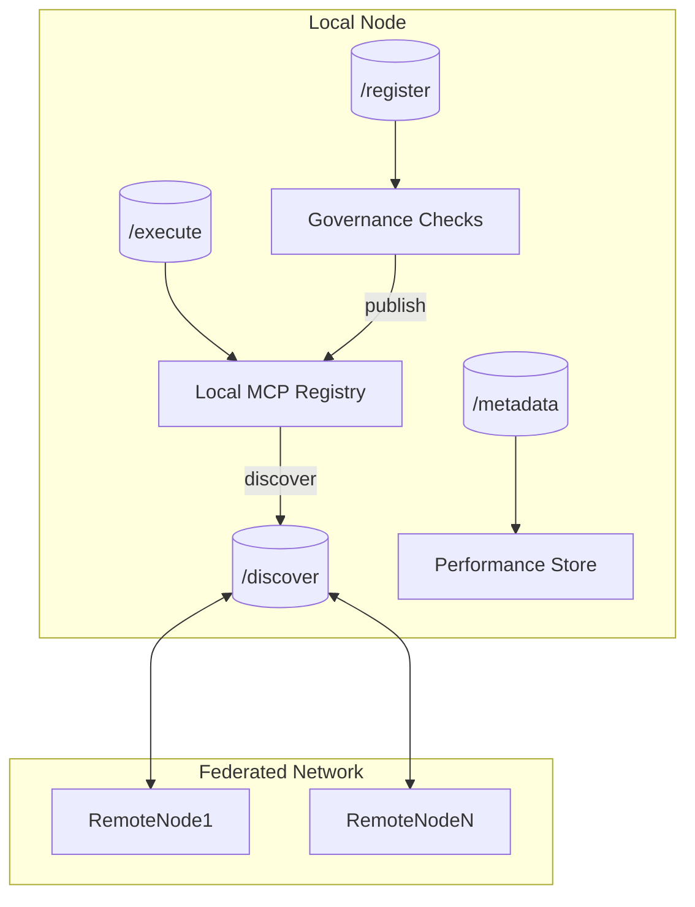

# Task 44: MCP Federation System Documentation

## Overview
The **MCP Federation System** enables multiple Alita-KGoT instances to **discover, share, and execute** Model Context Protocol (MCP) tools across organizational boundaries while preserving security, governance, and performance-learning capabilities.

Key deliverables:
1. `federation/mcp_federation.py` – FastAPI service exposing federation endpoints.  
2. `federation/federated_rag_mcp_engine.py` – Wrapper around `RAGMCPEngine` that imports remote MCP catalogs.  
3. Unit tests (`federation/tests/test_federation_api.py`) validating API and engine integration.

---

## ✨ Features
| Feature | Description |
|---------|-------------|
| **Service Endpoints** | `/discover`, `/execute`, `/metadata`, `/register` |
| **Dynamic Discovery** | Lists local & dynamically-registered MCPs with metadata |
| **Remote Execution** | Securely invokes MCPs on a remote node via REST |
| **Performance Sharing** | Nodes exchange anonymised execution metrics for federated learning |
| **Governance Pipeline** | Automated MCPQualityAssurance + MCPSecurity checks before federation publication |
| **Federated Engine** | `FederatedRAGMCPEngine` transparently merges remote MCPs into Pareto registry |
| **Token Auth** | Simple `Bearer` token auth (env var `MCP_FEDERATION_TOKEN`) |
| **Config via ENV** | `MCP_FEDERATION_NODES`, `MCP_FEDERATION_TOKEN` |
| **Winston-style Logging** | Consistent with cross-language logging policy |

---

## 🌐 API Reference

### Authentication
All endpoints expect the HTTP header:
```http
Authorization: Bearer <MCP_FEDERATION_TOKEN>
```
The token can be disabled by leaving the env var unset (development only).

### `GET /discover`
Returns array of MCP summaries available on this node.
```json
[
  {
    "name": "file_operations_mcp",
    "description": "File operations tool with archive handling…",
    "version": "1.0.0"
  }
]
```

### `POST /execute`
Executes a local MCP and returns its result.
Request body:
```json
{
  "mcp_name": "file_operations_mcp",
  "args": [],
  "kwargs": {"operation": "inspect", "source_path": "example.txt"}
}
```
Successful response:
```json
{"result": "<MCP output>"}
```

### `POST /metadata`
Uploads an array of performance records (privacy-preserving).
```json
[
  {"mcp_name": "file_operations_mcp", "success": true, "latency_ms": 85, "cost": 0.0003}
]
```
Returns **204 No Content**.

### `GET /metadata`
Retrieves recent performance records (default ≤ 500).

### `POST /register`
Submits metadata for a **new MCP** to be published in the federation.
```json
{
  "name": "custom_super_tool",
  "description": "Domain-specific analytics tool",
  "version": "0.1.0",
  "source_repo": "https://github.com/acme/custom_super_tool"
}
```
The service automatically runs QA & security checks before accepting.  
On success returns `201` with `{ "status": "registered", "name": "custom_super_tool" }`.

---

## 🏗️ Architecture


### Component Breakdown
1. **Local MCP Registry** – Combines:
   * Static Pareto MCPs (from `RAGMCPEngine`)
   * Dynamically-loaded toolbox MCP instances (`mcp_toolbox/…`)
   * Runtime registrations (`/register`)
2. **Governance Checks** – Calls:
   * `quality.mcp_quality_framework.run_quality_checks()`
   * `security.mcp_security_compliance.run_security_checks()`
3. **Performance Store** – In-memory placeholder; swap for DB in future.
4. **Federated Engine** – Fetches catalogs from `MCP_FEDERATION_NODES`, adds proxies (`name@host`) to Pareto registry, recalculates Pareto scores.

---

## ⚙️ Configuration
| Environment Variable | Purpose |
|----------------------|---------|
| `MCP_FEDERATION_TOKEN` | Bearer token used for auth on *both* client & server |
| `MCP_FEDERATION_NODES` | Comma-separated list of remote base URLs (e.g. `https://orgA.ai:8080,https://orgB.ai`) |

Example `.env`:
```env
MCP_FEDERATION_TOKEN=super-secret-token
MCP_FEDERATION_NODES=https://partner-node.ai:8000
```

---

## 🚀 Quick Start
```bash
# 1. Run a federation node
export MCP_FEDERATION_TOKEN="mytoken"
python -m alita_kgot_enhanced.federation.mcp_federation --host 0.0.0.0 --port 8000

# 2. Discover tools from another node
python - <<'PY'
from alita_kgot_enhanced.federation.mcp_federation import remote_discover
print(remote_discover('https://partner-node.ai:8000', token='mytoken'))
PY

# 3. Use Federated RAG-MCP Engine
python - <<'PY'
from alita_kgot_enhanced.federation.federated_rag_mcp_engine import FederatedRAGMCPEngine
engine = FederatedRAGMCPEngine(enable_llm_validation=False)
print(len(engine.pareto_registry.mcps), 'total MCPs (local + remote)')
PY
```

---

## 🧪 Testing
Run the dedicated test suite:
```bash
pytest alita-kgot-enhanced/federation/tests -v
```
Tests cover:
* Endpoint functionality & auth
* Dynamic registration and discovery
* Metadata ingestion
* Federated engine catalog merge

---

## 📈 Future Enhancements
1. **gRPC Streaming** for high-throughput execution.  
2. **JWT / OAuth2** authentication & RBAC.  
3. **Persistent Metrics DB** for PerformancePredictor federated learning.  
4. **Service Mesh** integration for node discovery & telemetry.  
5. **Capability Schema** exchange to improve remote MCP selection.

---

*Generated automatically by the Alita Script Generation Tool* ✨ 