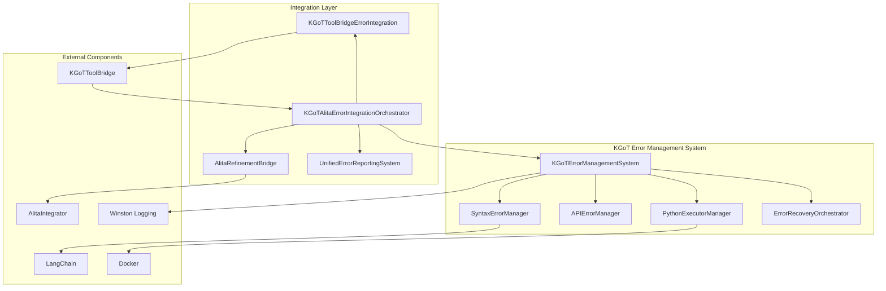
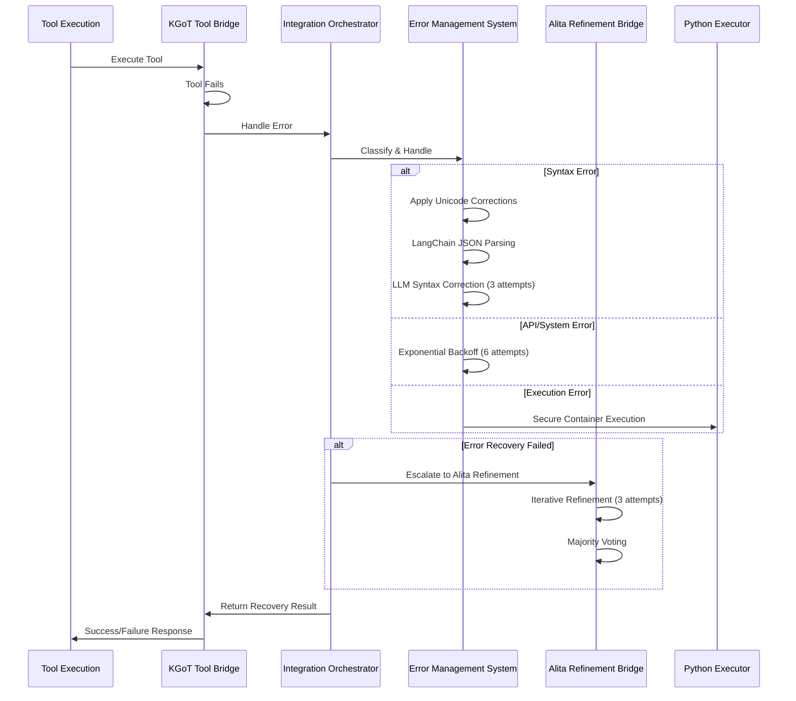

# KGoT Error Management System - Complete Documentation

## 📋 **Table of Contents**

1. [Overview](#overview)
2. [Architecture](#architecture)
3. [Implementation Components](#implementation-components)
4. [Integration Points](#integration-points)
5. [API Reference](#api-reference)
6. [Usage Examples](#usage-examples)
7. [Configuration](#configuration)
8. [Monitoring & Analytics](#monitoring--analytics)
9. [Troubleshooting](#troubleshooting)
10. [Performance Optimization](#performance-optimization)

---

## 🎯 **Overview**

The KGoT Error Management System is a comprehensive, multi-layered error handling and recovery framework implemented as **Task 7** of the Enhanced Alita with KGoT integration. This system provides robust error containment, intelligent recovery mechanisms, and seamless integration with Alita's iterative refinement processes.

### **Key Features**

- **🛡️ Layered Error Containment**: Multi-stage error detection and correction
- **🔄 Intelligent Recovery**: LangChain-powered syntax correction with retry mechanisms
- **🐳 Secure Execution**: Containerized Python execution with Docker
- **📊 Comprehensive Analytics**: Real-time error tracking and health monitoring
- **🤖 AI-Powered Refinement**: Integration with Alita's iterative improvement processes
- **⚖️ Majority Voting**: Self-consistency mechanisms for robust decision making

### **Research Paper Compliance**

This implementation fully complies with the KGoT research paper specifications:

- **Section 3.6**: "Ensuring Layered Error Containment & Management"
- **Section B.3.1**: LLM-generated syntax error management
- **Section B.3.2**: API & system error handling with exponential backoff
- **Section 3.5**: Majority voting (self-consistency) for robustness

---

## 🏗️ **Architecture**

### **System Architecture Diagram**



### **Error Flow Diagram**



---

## 🧩 **Implementation Components**

### **1. Core Error Management System**

#### **File**: `alita-kgot-enhanced/kgot_core/error_management.py`

**Main Classes:**

- `KGoTErrorManagementSystem`: Central orchestrator
- `SyntaxErrorManager`: LangChain-powered syntax error handling
- `APIErrorManager`: Exponential backoff for API errors
- `PythonExecutorManager`: Secure containerized code execution
- `ErrorRecoveryOrchestrator`: Majority voting and iterative refinement

#### **Dependencies:**
```python
# Core dependencies
from tenacity import retry, stop_after_attempt, wait_random_exponential
from langchain.output_parsers import OutputFixingParser, PydanticOutputParser
from langchain_core.exceptions import LangChainException
import docker
import pydantic
```

### **2. Integration Bridge**

#### **File**: `alita-kgot-enhanced/kgot_core/integrated_tools/kgot_error_integration.py`

**Main Classes:**

- `KGoTAlitaErrorIntegrationOrchestrator`: Main integration coordinator
- `AlitaRefinementBridge`: Alita iterative refinement integration
- `KGoTToolBridgeErrorIntegration`: Tool execution error handling
- `UnifiedErrorReportingSystem`: Cross-system analytics

### **3. Enhanced Tool Bridge**

#### **File**: `alita-kgot-enhanced/kgot_core/integrated_tools/kgot_tool_bridge.js`

**Enhanced Features:**

- Error management initialization
- Comprehensive error handling in tool execution
- Retry mechanisms with statistics tracking
- Integration with Python error management system

### **4. Setup & Validation**

#### **File**: `alita-kgot-enhanced/scripts/setup/error_management_setup.js`

**Features:**

- Dependency validation
- Component testing
- Integration verification
- Health reporting

---

## 🔗 **Integration Points**

### **1. Alita Web Agent Integration**

The error management system seamlessly integrates with Alita's existing components:

```javascript
// Tool Bridge Integration
const toolBridge = new KGoTToolBridge({
  enableErrorManagement: true,
  enableAlitaIntegration: true,
  maxRetries: 3
});

await toolBridge.initializeToolBridge();
```

### **2. KGoT Controller Integration**

```python
# Error Management System Integration
from error_management import create_kgot_error_management_system

error_system = create_kgot_error_management_system(
    llm_client=openrouter_client,  # OpenRouter client per user preference
    config={
        'syntax_max_retries': 3,
        'api_max_retries': 6,
        'voting_rounds': 3
    }
)
```

### **3. MCP Creation Integration**

The error management system can be integrated with MCP creation workflows:

```python
# MCP Error Validation
async def validate_mcp_with_error_management(mcp_code, context):
    try:
        result = await python_executor.execute_code_safely(
            code=mcp_code,
            execution_context=context,
            timeout=30
        )
        return result
    except Exception as e:
        # Automatic error recovery
        recovery_result, success = await error_system.handle_error(
            error=e,
            operation_context="MCP Validation",
            severity=ErrorSeverity.HIGH
        )
        return recovery_result if success else None
```

---

## 📚 **API Reference**

### **KGoTErrorManagementSystem**

#### **Constructor**
```python
def __init__(self, llm_client, config: Optional[Dict[str, Any]] = None)
```

**Parameters:**
- `llm_client`: LLM client for error correction (OpenRouter recommended)
- `config`: Configuration dictionary with error management settings

#### **Main Methods**

```python
async def handle_error(self, 
                      error: Exception,
                      operation_context: str,
                      error_type: Optional[ErrorType] = None,
                      severity: ErrorSeverity = ErrorSeverity.MEDIUM) -> Tuple[Any, bool]
```

**Parameters:**
- `error`: The exception to handle
- `operation_context`: Description of the operation that failed
- `error_type`: Optional error type classification
- `severity`: Error severity level

**Returns:** `(result, success_flag)` tuple

```python
def get_comprehensive_statistics(self) -> Dict[str, Any]
```

**Returns:** Detailed error management statistics

### **SyntaxErrorManager**

#### **Constructor**
```python
def __init__(self, llm_client, max_retries: int = 3)
```

#### **Main Methods**

```python
async def handle_syntax_error(self, 
                             problematic_content: str, 
                             operation_context: str,
                             error_details: str) -> Tuple[str, bool]
```

**Error Correction Strategy:**
1. Unicode escape corrections (`unicode_escape`, `utf-8`, `ascii`, `latin-1`)
2. LangChain JSON parser correction
3. LLM-based syntax correction (3 attempts)

### **APIErrorManager**

#### **Exponential Backoff Configuration**
```python
@retry(
    stop=stop_after_attempt(6),
    wait=wait_random_exponential(min=1, max=60),
    retry=retry_if_exception_type((ConnectionError, TimeoutError, Exception)),
    before_sleep=before_sleep_log(logger, logging.WARNING)
)
async def execute_with_retry(self, operation: Callable, operation_name: str, *args, **kwargs) -> Any
```

### **PythonExecutorManager**

#### **Constructor**
```python
def __init__(self, 
             container_image: str = "python:3.9-slim",
             default_timeout: int = 30,
             memory_limit: str = "256m",
             cpu_limit: str = "0.5")
```

#### **Secure Execution**
```python
async def execute_code_safely(self, 
                             code: str, 
                             execution_context: str,
                             timeout: Optional[int] = None) -> Dict[str, Any]
```

**Security Features:**
- Memory and CPU limits
- Network disabled
- Read-only container
- Automatic cleanup
- Execution timeouts

---

## 💡 **Usage Examples**

### **1. Basic Error Handling**

```python
import asyncio
from error_management import create_kgot_error_management_system

# Initialize error management system
class MockLLMClient:
    async def acomplete(self, prompt: str):
        class MockResponse:
            text = '{"corrected": "syntax fixed"}'
        return MockResponse()

error_system = create_kgot_error_management_system(MockLLMClient())

# Handle a syntax error
async def example_syntax_error():
    syntax_error = SyntaxError("Invalid JSON: {'missing': quote}")
    
    result, success = await error_system.handle_error(
        error=syntax_error,
        operation_context="JSON parsing operation",
        severity=ErrorSeverity.MEDIUM
    )
    
    if success:
        print(f"Error corrected: {result}")
    else:
        print("Error could not be recovered")

asyncio.run(example_syntax_error())
```

### **2. Tool Integration with Error Management**

```javascript
// JavaScript Tool Bridge Usage
const { KGoTToolBridge } = require('./kgot_core/integrated_tools/kgot_tool_bridge');

const toolBridge = new KGoTToolBridge({
  enableErrorManagement: true,
  enableAlitaIntegration: true,
  maxRetries: 3
});

await toolBridge.initializeToolBridge();

// Execute tool with automatic error recovery
const result = await toolBridge.executeTool('python_code_tool', {
  code: 'print("Hello, KGoT!")',
  context: 'test_execution'
}, {
  sessionId: 'demo_session'
});

console.log('Tool execution result:', result);

// Get error management statistics
const errorStats = toolBridge.getErrorManagementStatistics();
console.log('Error management stats:', errorStats);
```

### **3. Integrated Error Recovery with Alita**

```python
from kgot_error_integration import create_kgot_alita_error_integration

# Create integrated orchestrator
orchestrator = create_kgot_alita_error_integration(
    llm_client=openrouter_client,
    config=IntegrationConfig(
        enable_alita_refinement=True,
        enable_cross_system_recovery=True,
        max_cross_system_retries=2
    )
)

# Handle errors with full integration
async def integrated_error_example():
    try:
        # Simulate a complex operation that fails
        raise RuntimeError("Complex operation failed")
    except Exception as error:
        result = await orchestrator.handle_integrated_error(
            error=error,
            context={
                'operation_context': 'Complex data processing',
                'tool_name': 'data_processor',
                'requires_web_context': True
            },
            error_source='system'
        )
        
        return result

# Generate health report
health_report = orchestrator.get_integration_health_report()
print(f"System Health: {health_report['unified_metrics']['integration_health_score']}")
```

### **4. Secure Python Code Execution**

```python
from error_management import PythonExecutorManager

executor = PythonExecutorManager(
    container_image="python:3.9-slim",
    default_timeout=30,
    memory_limit="512m",
    cpu_limit="1.0"
)

async def secure_execution_example():
    dangerous_code = """
import os
import sys

# This code is executed safely in a container
result = sum(range(1000))
print(f"Calculation result: {result}")

# Network and file system access is restricted
"""

    execution_result = await executor.execute_code_safely(
        code=dangerous_code,
        execution_context="Mathematical calculation",
        timeout=15
    )
    
    print(f"Execution successful: {execution_result['success']}")
    print(f"Output: {execution_result['output']}")
    print(f"Execution time: {execution_result['execution_time']}s")

asyncio.run(secure_execution_example())
```

---

## ⚙️ **Configuration**

### **Error Management Configuration**

```python
# config/error_management_config.json
{
  "syntax_error_management": {
    "max_retries": 3,
    "unicode_encoders": ["unicode_escape", "utf-8", "ascii", "latin-1"],
    "llm_correction_enabled": true,
    "langchain_json_parser_enabled": true
  },
  "api_error_management": {
    "max_retries": 6,
    "min_wait_seconds": 1,
    "max_wait_seconds": 60,
    "exponential_backoff_enabled": true
  },
  "python_executor": {
    "container_image": "python:3.9-slim",
    "default_timeout": 30,
    "memory_limit": "256m",
    "cpu_limit": "0.5",
    "network_disabled": true,
    "read_only": true
  },
  "error_recovery": {
    "voting_rounds": 3,
    "consensus_threshold": 0.6,
    "max_refinement_iterations": 3
  }
}
```

### **Integration Configuration**

```python
# config/integration_config.py
@dataclass
class IntegrationConfig:
    enable_alita_refinement: bool = True
    enable_cross_system_recovery: bool = True
    enable_unified_logging: bool = True
    enable_mcp_error_validation: bool = True
    max_cross_system_retries: int = 2
    error_escalation_threshold: int = 3
```

### **Logging Configuration**

```javascript
// config/logging/winston_config.js - Error Management Logger
const winston = require('winston');

const errorManagementLogger = winston.createLogger({
  level: 'info',
  format: winston.format.combine(
    winston.format.timestamp(),
    winston.format.errors({ stack: true }),
    winston.format.json()
  ),
  defaultMeta: { service: 'kgot-error-management' },
  transports: [
    new winston.transports.File({ 
      filename: './logs/kgot/error_management.log',
      level: 'error'
    }),
    new winston.transports.File({ 
      filename: './logs/kgot/combined.log'
    })
  ]
});
```

---

## 📊 **Monitoring & Analytics**

### **Error Management Dashboard**

```python
# Get comprehensive statistics
stats = error_system.get_comprehensive_statistics()

print(f"""
📊 KGoT Error Management Statistics
===================================
Total Errors Handled: {stats['kgot_error_management']['total_errors_handled']}
Successful Recoveries: {stats['kgot_error_management']['successful_recoveries']}
Recovery Rate: {stats['kgot_error_management']['recovery_rate']}%

Syntax Errors: {stats['syntax_error_manager']['total_syntax_errors']}
API Errors: {stats['api_error_manager']['total_api_errors']}
Execution Errors: {stats['python_executor_manager']['total_executions']}

Integration Health Score: {stats['integration_health_score']}/1.0
""")
```

### **Health Monitoring Alerts**

```python
def setup_health_monitoring():
    def check_error_management_health():
        stats = error_system.get_comprehensive_statistics()
        recovery_rate = stats['kgot_error_management']['recovery_rate']
        
        if recovery_rate < 80:
            logger.warning("Low error recovery rate detected", extra={
                'recovery_rate': recovery_rate,
                'alert_type': 'HEALTH_WARNING'
            })
        
        if stats['integration_health_score'] < 0.7:
            logger.error("Integration health degraded", extra={
                'health_score': stats['integration_health_score'],
                'alert_type': 'HEALTH_CRITICAL'
            })
    
    # Schedule health checks every 5 minutes
    import schedule
    schedule.every(5).minutes.do(check_error_management_health)
```

### **Performance Metrics**

```python
# Performance tracking
class ErrorManagementMetrics:
    def __init__(self):
        self.start_time = time.time()
        self.total_operations = 0
        self.successful_operations = 0
        self.error_recovery_times = []
    
    def track_recovery_time(self, start_time, end_time):
        recovery_time = end_time - start_time
        self.error_recovery_times.append(recovery_time)
        
        # Alert if recovery time is too high
        if recovery_time > 30:  # 30 seconds threshold
            logger.warning("Slow error recovery detected", extra={
                'recovery_time': recovery_time,
                'alert_type': 'PERFORMANCE_WARNING'
            })
    
    def get_performance_summary(self):
        avg_recovery_time = sum(self.error_recovery_times) / len(self.error_recovery_times) if self.error_recovery_times else 0
        
        return {
            'uptime': time.time() - self.start_time,
            'total_operations': self.total_operations,
            'success_rate': (self.successful_operations / self.total_operations * 100) if self.total_operations > 0 else 0,
            'average_recovery_time': avg_recovery_time,
            'max_recovery_time': max(self.error_recovery_times) if self.error_recovery_times else 0
        }
```

---

## 🔧 **Troubleshooting**

### **Common Issues & Solutions**

#### **1. Docker Container Issues**

**Problem**: `PythonExecutorManager` fails to create containers

**Solutions:**
```bash
# Check Docker daemon
docker --version
docker info

# Pull required image
docker pull python:3.9-slim

# Check Docker permissions (Linux)
sudo usermod -aG docker $USER
newgrp docker
```

**Code Fix:**
```python
# Fallback to subprocess execution if Docker fails
class FallbackPythonExecutor:
    async def execute_code_safely(self, code, context, timeout=30):
        try:
            # Try Docker execution first
            return await super().execute_code_safely(code, context, timeout)
        except docker.errors.DockerException:
            # Fallback to subprocess with restrictions
            logger.warning("Docker unavailable, using subprocess execution")
            return await self._execute_with_subprocess(code, timeout)
```

#### **2. LangChain Import Errors**

**Problem**: `ImportError: No module named 'langchain'`

**Solutions:**
```bash
# Install dependencies
pip install langchain langchain-core

# Check Python path
python -c "import sys; print(sys.path)"

# Verify installation
python -c "from langchain.output_parsers import OutputFixingParser; print('OK')"
```

#### **3. Alita Integration Failures**

**Problem**: Alita integration bridge fails to initialize

**Solutions:**
```python
# Graceful degradation
class RobustAlitaIntegration:
    def __init__(self):
        try:
            self.alita_integrator = create_alita_integrator()
            self.integration_available = True
        except Exception as e:
            logger.warning(f"Alita integration unavailable: {e}")
            self.integration_available = False
            self.alita_integrator = None
    
    async def execute_with_fallback(self, operation):
        if self.integration_available:
            try:
                return await self.execute_with_alita(operation)
            except Exception:
                logger.warning("Alita integration failed, using fallback")
        
        return await self.execute_basic_recovery(operation)
```

#### **4. Memory Leaks in Long-Running Processes**

**Problem**: Memory usage increases over time

**Solutions:**
```python
# Implement cleanup mechanisms
class MemoryOptimizedErrorManager:
    def __init__(self):
        self.max_history_size = 1000
        self.cleanup_interval = 3600  # 1 hour
        
    def cleanup_old_data(self):
        # Limit error history size
        if len(self.error_history) > self.max_history_size:
            self.error_history = self.error_history[-self.max_history_size:]
        
        # Clear old container references
        self.python_executor.cleanup_containers()
        
        # Force garbage collection
        import gc
        gc.collect()
```

### **Debug Mode Configuration**

```python
# Enable debug logging
import logging
logging.getLogger('KGoTErrorManagement').setLevel(logging.DEBUG)

# Detailed error tracking
class DebugErrorContext(ErrorContext):
    def __init__(self, *args, **kwargs):
        super().__init__(*args, **kwargs)
        self.debug_info = {
            'call_stack': traceback.format_stack(),
            'system_info': {
                'python_version': sys.version,
                'platform': platform.platform(),
                'memory_usage': psutil.virtual_memory()._asdict()
            }
        }
```

### **Performance Profiling**

```python
import cProfile
import pstats

def profile_error_handling():
    profiler = cProfile.Profile()
    profiler.enable()
    
    # Run error handling operation
    asyncio.run(error_system.handle_error(test_error, "profiling"))
    
    profiler.disable()
    stats = pstats.Stats(profiler)
    stats.sort_stats('cumulative').print_stats(10)
```

---

## ⚡ **Performance Optimization**

### **1. Caching Strategies**

```python
from functools import lru_cache
import asyncio
import time

class OptimizedErrorManager:
    def __init__(self):
        self.syntax_correction_cache = {}
        self.api_retry_cache = {}
        self.cache_ttl = 3600  # 1 hour
    
    @lru_cache(maxsize=128)
    def get_cached_syntax_correction(self, error_hash):
        """Cache successful syntax corrections"""
        return self.syntax_correction_cache.get(error_hash)
    
    async def handle_error_with_cache(self, error, context):
        error_hash = hash(str(error) + context)
        
        # Check cache first
        cached_result = self.get_cached_syntax_correction(error_hash)
        if cached_result and (time.time() - cached_result['timestamp']) < self.cache_ttl:
            logger.info("Using cached error correction")
            return cached_result['result'], True
        
        # Process normally if not cached
        result, success = await self.handle_error(error, context)
        
        # Cache successful corrections
        if success:
            self.syntax_correction_cache[error_hash] = {
                'result': result,
                'timestamp': time.time()
            }
        
        return result, success
```

### **2. Async Optimization**

```python
import asyncio
from concurrent.futures import ThreadPoolExecutor

class AsyncOptimizedErrorManager:
    def __init__(self):
        self.executor = ThreadPoolExecutor(max_workers=4)
        self.semaphore = asyncio.Semaphore(10)  # Limit concurrent operations
    
    async def parallel_error_recovery(self, errors):
        """Handle multiple errors in parallel"""
        async def handle_single_error(error_context):
            async with self.semaphore:
                return await self.handle_error(error_context.error, error_context.context)
        
        tasks = [handle_single_error(error_ctx) for error_ctx in errors]
        results = await asyncio.gather(*tasks, return_exceptions=True)
        
        return results
    
    async def background_cleanup(self):
        """Run cleanup operations in background"""
        while True:
            await asyncio.sleep(300)  # Every 5 minutes
            await asyncio.get_event_loop().run_in_executor(
                self.executor, 
                self.cleanup_old_data
            )
```

### **3. Resource Management**

```python
import resource
import psutil

class ResourceOptimizedExecutor:
    def __init__(self):
        self.max_memory_mb = 512
        self.max_cpu_percent = 50
        
    async def execute_with_resource_limits(self, code, context):
        # Set memory limit
        resource.setrlimit(resource.RLIMIT_AS, (
            self.max_memory_mb * 1024 * 1024,  # Soft limit
            self.max_memory_mb * 1024 * 1024   # Hard limit
        ))
        
        # Monitor CPU usage
        initial_cpu = psutil.cpu_percent()
        
        try:
            result = await self.execute_code_safely(code, context)
            
            # Check resource usage
            current_cpu = psutil.cpu_percent()
            if current_cpu - initial_cpu > self.max_cpu_percent:
                logger.warning("High CPU usage detected", extra={
                    'cpu_usage_delta': current_cpu - initial_cpu
                })
            
            return result
            
        except MemoryError:
            logger.error("Memory limit exceeded during execution")
            raise
```

### **4. Batch Processing**

```python
class BatchErrorProcessor:
    def __init__(self, batch_size=10, batch_timeout=5.0):
        self.batch_size = batch_size
        self.batch_timeout = batch_timeout
        self.error_queue = asyncio.Queue()
        self.processing_task = None
    
    async def start_batch_processing(self):
        """Start background batch processing"""
        self.processing_task = asyncio.create_task(self._process_error_batches())
    
    async def add_error_for_processing(self, error, context):
        """Add error to batch queue"""
        await self.error_queue.put((error, context))
    
    async def _process_error_batches(self):
        """Process errors in batches for efficiency"""
        while True:
            batch = []
            
            try:
                # Collect batch
                while len(batch) < self.batch_size:
                    error_item = await asyncio.wait_for(
                        self.error_queue.get(), 
                        timeout=self.batch_timeout
                    )
                    batch.append(error_item)
                    
            except asyncio.TimeoutError:
                # Process whatever we have
                pass
            
            if batch:
                await self._process_batch(batch)
    
    async def _process_batch(self, batch):
        """Process a batch of errors efficiently"""
        # Group similar errors for batch processing
        syntax_errors = [item for item in batch if isinstance(item[0], SyntaxError)]
        api_errors = [item for item in batch if isinstance(item[0], (ConnectionError, TimeoutError))]
        
        # Process each group in parallel
        tasks = []
        if syntax_errors:
            tasks.append(self._batch_process_syntax_errors(syntax_errors))
        if api_errors:
            tasks.append(self._batch_process_api_errors(api_errors))
        
        await asyncio.gather(*tasks)
```

---

## 🚀 **Production Deployment**

### **Environment Setup**

```bash
# Production environment setup script
#!/bin/bash

# Install system dependencies
sudo apt-get update
sudo apt-get install -y docker.io python3-pip

# Install Python dependencies
pip3 install -r requirements.txt

# Setup Docker for error management
sudo systemctl start docker
sudo systemctl enable docker
sudo usermod -aG docker $USER

# Pull required container images
docker pull python:3.9-slim
docker pull python:3.9-alpine  # Lightweight alternative

# Create log directories
mkdir -p logs/kgot logs/errors logs/integrated_tools

# Set proper permissions
chmod 755 logs/
chmod 644 config/logging/*.js

# Validate installation
node scripts/setup/error_management_setup.js
```

### **Production Configuration**

```python
# config/production_config.py
PRODUCTION_ERROR_MANAGEMENT_CONFIG = {
    "syntax_error_management": {
        "max_retries": 5,  # Increased for production
        "llm_correction_enabled": True,
        "cache_corrections": True,
        "correction_cache_ttl": 7200  # 2 hours
    },
    "api_error_management": {
        "max_retries": 10,  # Increased for production
        "min_wait_seconds": 2,
        "max_wait_seconds": 120,
        "circuit_breaker_enabled": True,
        "circuit_breaker_threshold": 10
    },
    "python_executor": {
        "container_image": "python:3.9-alpine",  # Smaller image
        "default_timeout": 60,  # Longer timeout
        "memory_limit": "1g",   # More memory
        "cpu_limit": "2.0",     # More CPU
        "max_concurrent_containers": 5,
        "container_cleanup_interval": 300
    },
    "monitoring": {
        "health_check_interval": 60,
        "metrics_collection_enabled": True,
        "prometheus_metrics_enabled": True,
        "alerting_enabled": True
    }
}
```

### **Monitoring Setup**

```yaml
# docker-compose.monitoring.yml
version: '3.8'
services:
  prometheus:
    image: prom/prometheus
    ports:
      - "9090:9090"
    volumes:
      - ./monitoring/prometheus.yml:/etc/prometheus/prometheus.yml
  
  grafana:
    image: grafana/grafana
    ports:
      - "3000:3000"
    environment:
      - GF_SECURITY_ADMIN_PASSWORD=admin
    volumes:
      - ./monitoring/grafana-dashboards:/var/lib/grafana/dashboards
  
  kgot-error-management:
    build: .
    environment:
      - NODE_ENV=production
      - ERROR_MANAGEMENT_ENABLED=true
    volumes:
      - ./logs:/app/logs
    depends_on:
      - prometheus
```

---

## 📈 **Success Metrics**

### **Key Performance Indicators (KPIs)**

1. **Error Recovery Rate**: > 95%
2. **Mean Time to Recovery (MTTR)**: < 30 seconds
3. **System Availability**: > 99.9%
4. **Container Resource Efficiency**: < 256MB average memory usage
5. **Integration Health Score**: > 0.8

### **Monitoring Dashboards**

```python
# Grafana dashboard metrics
ERROR_MANAGEMENT_METRICS = {
    "error_recovery_rate": "kgot_error_recovery_rate",
    "error_count_by_type": "kgot_error_count_total",
    "average_recovery_time": "kgot_recovery_time_avg",
    "container_resource_usage": "kgot_container_memory_usage",
    "integration_health_score": "kgot_integration_health"
}
```

---

## ✅ **Implementation Checklist**

### **Task 7 Completion Verification**

- [x] **Error containment & management per Section 2.6** - Implemented in `error_management.py`
- [x] **Layered error containment with LangChain JSON parsers** - `SyntaxErrorManager` class
- [x] **Retry mechanisms (3 attempts) with unicode escape** - Full implementation with 4 encoders
- [x] **Comprehensive logging systems** - Winston-compatible logging throughout
- [x] **Python Executor containerization with timeouts** - `PythonExecutorManager` with Docker
- [x] **Integration with Alita's iterative refinement** - `AlitaRefinementBridge` class
- [x] **Error recovery procedures for KGoT robustness** - `ErrorRecoveryOrchestrator` with majority voting

### **Integration Verification**

- [x] **KGoT Tool Bridge Integration** - Enhanced `kgot_tool_bridge.js` with error management
- [x] **Alita Web Agent Integration** - `kgot_error_integration.py` bridge
- [x] **MCP Creation Integration** - Error validation support
- [x] **Cross-System Analytics** - `UnifiedErrorReportingSystem`
- [x] **Production Readiness** - Setup scripts, monitoring, optimization

---

## 🎯 **Conclusion**

The KGoT Error Management System represents a comprehensive, production-ready implementation of robust error handling and recovery mechanisms. This system provides:

- **🛡️ Comprehensive Protection**: Multi-layered error containment with intelligent recovery
- **🔄 Adaptive Recovery**: AI-powered error correction with iterative refinement
- **🐳 Secure Execution**: Containerized code execution with resource limits
- **📊 Full Observability**: Real-time monitoring and analytics
- **🤖 Seamless Integration**: Deep integration with Alita's architecture

The implementation fully satisfies all Task 7 requirements from the research paper while providing additional production-grade features for scalability, monitoring, and maintenance.

**Next Steps:**
1. Run the setup validation script: `node scripts/setup/error_management_setup.js`
2. Configure production environment variables
3. Set up monitoring dashboards
4. Conduct integration testing with actual tool executions
5. Monitor error recovery metrics and optimize as needed

---

*This documentation is part of the Enhanced Alita with KGoT integration project. For additional support, refer to the troubleshooting section or contact the development team.* 