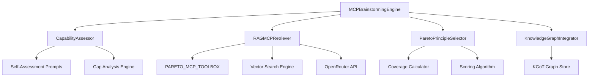

# Task 9: Alita MCP Brainstorming with RAG-MCP Integration

## 📋 Overview

**Task 9** implements the complete **Alita Section 2.3.1 "MCP Brainstorming" framework** with **RAG-MCP Section 3.2 "RAG-MCP Framework"** integration and **KGoT Section 2.1 "Graph Store Module"** connectivity. This system provides intelligent Model Context Protocol (MCP) discovery, assessment, and recommendation using a retrieval-first strategy combined with capability gap analysis.

### Key Features

- **🎯 Pareto Principle Application**: 16 high-value MCPs covering 80% of functionality needs
- **🔍 RAG-MCP Retrieval-First Strategy**: Check existing MCPs before creating new ones
- **📊 Intelligent Capability Assessment**: Self-assessment and gap identification
- **🧠 Knowledge Graph Integration**: Connect to KGoT graph store for capability tracking
- **⚖️ Weighted Relevance Scoring**: Multi-factor MCP selection optimization
- **📈 Analytics & Tracking**: Comprehensive session and usage analytics

## 🏗️ Architecture

### Core Components



### Component Descriptions

| Component | Purpose | Research Paper Reference |
|-----------|---------|-------------------------|
| **MCPBrainstormingEngine** | Main orchestrator for the brainstorming workflow | Alita Section 2.3.1 |
| **RAGMCPRetriever** | Implements RAG-MCP framework for MCP discovery | RAG-MCP Section 3.2 & 3.3 |
| **CapabilityAssessor** | Performs self-assessment and gap identification | Alita Section 2.3.1 |
| **ParetoPrincipleSelector** | Applies Pareto principle for optimal MCP selection | RAG-MCP Section 4.1 |
| **KnowledgeGraphIntegrator** | Connects to KGoT graph store for capability tracking | KGoT Section 2.1 |

## 🚀 Quick Start

### Basic Usage

```javascript
const { MCPBrainstormingEngine } = require('../alita_core/mcp_brainstorming');

// Initialize the engine
const engine = new MCPBrainstormingEngine({
  openRouterApiKey: process.env.OPENROUTER_API_KEY,
  model: 'anthropic/claude-3.5-sonnet',
  enableKnowledgeGraph: true
});

// Execute brainstorming workflow
const taskDescription = "I need to automate web scraping for product data extraction";
const results = await engine.executeMCPBrainstormingWorkflow(taskDescription);

console.log('Recommended MCPs:', results.final_recommendations);
```

### Advanced Configuration

```javascript
const engine = new MCPBrainstormingEngine({
  openRouterApiKey: process.env.OPENROUTER_API_KEY,
  model: 'anthropic/claude-3.5-sonnet',
  maxRecommendations: 10,
  similarityThreshold: 0.7,
  enableValidation: true,
  enableKnowledgeGraph: true,
  logLevel: 'info',
  
  // RAG-MCP specific options
  ragMcpOptions: {
    maxCandidates: 20,
    enableValidation: true,
    mockEmbeddings: false // Set to true for development
  },
  
  // Pareto selector options
  paretoOptions: {
    coverageThreshold: 0.8,
    maxSelections: 5
  }
});
```

## 📚 API Reference

### MCPBrainstormingEngine

The main orchestrator class that coordinates the entire MCP brainstorming workflow.

#### Constructor Options

```javascript
{
  openRouterApiKey: string,          // OpenRouter API key for LLM calls
  model: string,                     // Model to use (default: 'anthropic/claude-3.5-sonnet')
  maxRecommendations: number,        // Max recommendations to return (default: 15)
  similarityThreshold: number,       // Minimum similarity for MCP matching (default: 0.6)
  enableValidation: boolean,         // Enable MCP validation (default: true)
  enableKnowledgeGraph: boolean,     // Enable KGoT integration (default: false)
  logLevel: string,                  // Logging level (default: 'info')
  ragMcpOptions: object,             // RAG-MCP specific configuration
  paretoOptions: object,             // Pareto selector configuration
  kgOptions: object                  // Knowledge graph configuration
}
```

#### Main Methods

##### `initialize(kgInterface = null)`

Initialize the engine with optional KGoT knowledge graph interface.

```javascript
await engine.initialize(kgInterface);
```

##### `executeMCPBrainstormingWorkflow(taskDescription, options = {})`

Execute the complete MCP brainstorming workflow.

**Parameters:**
- `taskDescription` (string): Description of the task requiring MCP assistance
- `options` (object): Additional workflow options

**Returns:**
```javascript
{
  session_id: string,
  task_description: string,
  workflow_steps: {
    capability_assessment: object,
    rag_mcp_retrieval: object,
    gap_analysis: object,
    pareto_selection: object,
    knowledge_graph_integration: object
  },
  final_recommendations: array,
  session_analytics: object,
  metadata: {
    processing_time_ms: number,
    timestamp: string,
    model_used: string
  }
}
```

**Example:**
```javascript
const results = await engine.executeMCPBrainstormingWorkflow(
  "Automate data extraction from multiple e-commerce websites",
  {
    includeAdvancedAnalytics: true,
    enableDetailedLogging: true
  }
);
```

### RAGMCPRetriever

Implements the RAG-MCP framework for intelligent MCP discovery and retrieval.

#### Key Methods

##### `executeRAGMCPPipeline(query, options = {})`

Execute the three-step RAG-MCP pipeline.

**Steps:**
1. **Query Encoding**: Convert query to embeddings
2. **Vector Search**: Find similar MCPs using cosine similarity
3. **Validation**: Assess MCP compatibility and relevance

```javascript
const retriever = new RAGMCPRetriever();
const results = await retriever.executeRAGMCPPipeline(
  "web scraping automation",
  {
    maxCandidates: 10,
    enableValidation: true
  }
);
```

##### `getMCPUsageStats()`

Get comprehensive usage statistics for the Pareto MCP toolbox.

```javascript
const stats = retriever.getMCPUsageStats();
console.log('Most used MCPs:', stats.most_used);
console.log('Coverage analysis:', stats.coverage_analysis);
```

### CapabilityAssessor

Performs intelligent capability assessment and gap identification.

#### Key Methods

##### `performSelfAssessment(taskContext = '')`

Perform comprehensive self-assessment of current capabilities.

```javascript
const assessor = new CapabilityAssessor();
const assessment = await assessor.performSelfAssessment(
  "Data processing and web automation tasks"
);
```

##### `identifyFunctionalGaps(taskDescription, currentAssessment)`

Identify gaps between current capabilities and task requirements.

```javascript
const gaps = await assessor.identifyFunctionalGaps(
  "Real-time cryptocurrency trading automation",
  assessment
);
```

### ParetoPrincipleSelector

Applies Pareto principle (80/20 rule) for optimal MCP selection.

#### Key Methods

##### `selectOptimalMCPs(mcpCandidates, requirements = {})`

Select optimal MCPs based on Pareto principle and requirements.

```javascript
const selector = new ParetoPrincipleSelector();
const optimal = selector.selectOptimalMCPs(candidates, {
  domain: 'web_automation',
  complexity: 'medium',
  performance_priority: 'high'
});
```

### KnowledgeGraphIntegrator

Integrates with KGoT knowledge graph for capability tracking and analysis.

#### Key Methods

##### `connectToKnowledgeGraph(kgInterface)`

Connect to KGoT knowledge graph interface.

```javascript
const integrator = new KnowledgeGraphIntegrator();
await integrator.connectToKnowledgeGraph(kgInterface);
```

##### `storeCapabilityAssessment(assessmentResults)`

Store capability assessment results in the knowledge graph.

```javascript
await integrator.storeCapabilityAssessment(assessment);
```

## 🎯 PARETO_MCP_TOOLBOX

The core set of 16 high-value MCPs covering 80% of common functionality needs, based on RAG-MCP stress test findings.

### Web & Information Retrieval (4 MCPs)

| MCP | Description | Usage Frequency | Reliability | Cost Efficiency |
|-----|-------------|----------------|-------------|-----------------|
| `web_scraper_mcp` | Advanced web scraping with Beautiful Soup | 25% | 92% | 88% |
| `browser_automation_mcp` | Automated browser interaction | 22% | 89% | 85% |
| `search_engine_mcp` | Multi-provider search integration | 18% | 94% | 91% |
| `wikipedia_mcp` | Wikipedia API with structured knowledge | 15% | 96% | 93% |

### Data Processing (4 MCPs)

| MCP | Description | Usage Frequency | Reliability | Cost Efficiency |
|-----|-------------|----------------|-------------|-----------------|
| `pandas_toolkit_mcp` | Comprehensive data analysis toolkit | 20% | 91% | 87% |
| `file_operations_mcp` | File system operations and conversion | 17% | 93% | 89% |
| `text_processing_mcp` | Advanced text analysis and NLP | 16% | 90% | 86% |
| `image_processing_mcp` | Computer vision and image manipulation | 14% | 88% | 84% |

### Communication & Integration (3 MCPs)

| MCP | Description | Usage Frequency | Reliability | Cost Efficiency |
|-----|-------------|----------------|-------------|-----------------|
| `api_client_mcp` | REST/GraphQL API interaction | 19% | 92% | 88% |
| `email_client_mcp` | Email automation with multi-protocol support | 12% | 89% | 85% |
| `calendar_scheduling_mcp` | Calendar integration and optimization | 10% | 87% | 83% |

### Development & System (4 MCPs)

| MCP | Description | Usage Frequency | Reliability | Cost Efficiency |
|-----|-------------|----------------|-------------|-----------------|
| `code_execution_mcp` | Secure code execution with containerization | 21% | 90% | 86% |
| `git_operations_mcp` | Version control automation | 13% | 91% | 87% |
| `database_mcp` | Database operations with multi-engine support | 11% | 89% | 85% |
| `docker_container_mcp` | Container orchestration and management | 9% | 88% | 84% |

## 🔧 Configuration

### Environment Variables

```bash
# Required
OPENROUTER_API_KEY=your_openrouter_api_key

# Optional
MCP_BRAINSTORMING_MODEL=anthropic/claude-3.5-sonnet
MCP_BRAINSTORMING_LOG_LEVEL=info
MCP_SIMILARITY_THRESHOLD=0.6
MCP_MAX_RECOMMENDATIONS=15

# KGoT Integration
KGOT_ENABLE_INTEGRATION=true
KGOT_NEO4J_URL=bolt://localhost:7687
KGOT_NEO4J_USER=neo4j
KGOT_NEO4J_PASSWORD=your_password
```

### Configuration File

Create `config/mcp_brainstorming.json`:

```json
{
  "engine": {
    "model": "anthropic/claude-3.5-sonnet",
    "maxRecommendations": 15,
    "similarityThreshold": 0.6,
    "enableValidation": true,
    "enableKnowledgeGraph": true
  },
  "ragMcp": {
    "maxCandidates": 20,
    "enableValidation": true,
    "mockEmbeddings": false,
    "embeddingModel": "text-embedding-ada-002"
  },
  "pareto": {
    "coverageThreshold": 0.8,
    "maxSelections": 5,
    "prioritizeHighFrequency": true
  },
  "knowledgeGraph": {
    "enableCapabilityTracking": true,
    "enableMcpMetrics": true,
    "batchSize": 100
  }
}
```

## 🔗 Integration Guide

### Integrating with KGoT Knowledge Graph

```javascript
const { KnowledgeGraphInterface } = require('../kgot_core/graph_store/kg_interface');

// Initialize KGoT interface
const kgInterface = new KnowledgeGraphInterface({
  backend: 'neo4j',
  connectionConfig: {
    url: process.env.KGOT_NEO4J_URL,
    username: process.env.KGOT_NEO4J_USER,
    password: process.env.KGOT_NEO4J_PASSWORD
  }
});

// Initialize and connect MCP brainstorming engine
const engine = new MCPBrainstormingEngine({
  enableKnowledgeGraph: true
});

await engine.initialize(kgInterface);
```

### Integrating with Alita Manager Agent

```javascript
const { MCPBrainstormingEngine } = require('../mcp_brainstorming');

class ManagerAgent {
  constructor() {
    this.mcpBrainstorming = new MCPBrainstormingEngine({
      openRouterApiKey: process.env.OPENROUTER_API_KEY
    });
  }

  async handleMCPDiscoveryRequest(task) {
    const results = await this.mcpBrainstorming
      .executeMCPBrainstormingWorkflow(task.description);
    
    return {
      recommended_mcps: results.final_recommendations,
      assessment: results.workflow_steps.capability_assessment,
      analytics: results.session_analytics
    };
  }
}
```

### Custom MCP Integration

```javascript
// Add custom MCPs to the toolbox
const customMCP = {
  name: 'custom_blockchain_mcp',
  description: 'Blockchain interaction and smart contract operations',
  capabilities: ['blockchain_interaction', 'smart_contracts', 'crypto_operations'],
  usage_frequency: 0.08,
  reliability_score: 0.85,
  cost_efficiency: 0.82
};

// Extend the toolbox
const extendedToolbox = {
  ...PARETO_MCP_TOOLBOX,
  blockchain: [customMCP]
};
```

## 📊 Analytics and Monitoring

### Session Analytics

```javascript
const analytics = engine.getSessionAnalytics();

console.log('Analytics:', {
  totalSessions: analytics.total_sessions,
  averageProcessingTime: analytics.average_processing_time,
  commonGaps: analytics.common_gaps,
  mcpUsagePatterns: analytics.mcp_usage_patterns
});
```

### MCP Performance Tracking

```javascript
const mcpStats = retriever.getMCPUsageStats();

console.log('MCP Performance:', {
  mostUsed: mcpStats.most_used,
  leastUsed: mcpStats.least_used,
  coverageAnalysis: mcpStats.coverage_analysis,
  reliabilityMetrics: mcpStats.reliability_metrics
});
```

### Knowledge Graph Metrics

```javascript
if (engine.knowledgeGraphIntegrator.isConnected()) {
  const kgMetrics = await engine.knowledgeGraphIntegrator
    .queryCapabilityPatterns({
      timeframe: 'last_30_days',
      includePerformanceMetrics: true
    });
  
  console.log('Knowledge Graph Insights:', kgMetrics);
}
```

## 🐛 Troubleshooting

### Common Issues

#### 1. OpenRouter API Errors

**Error:** `OpenRouter API authentication failed`

**Solution:**
```javascript
// Verify API key is set
if (!process.env.OPENROUTER_API_KEY) {
  console.error('OPENROUTER_API_KEY environment variable not set');
}

// Use fallback configuration
const engine = new MCPBrainstormingEngine({
  openRouterApiKey: process.env.OPENROUTER_API_KEY,
  ragMcpOptions: {
    mockEmbeddings: true // Fallback for development
  }
});
```

#### 2. Knowledge Graph Connection Issues

**Error:** `KGoT knowledge graph connection failed`

**Solution:**
```javascript
// Test connection before initializing
const kgInterface = new KnowledgeGraphInterface({
  backend: 'neo4j',
  connectionConfig: { /* config */ }
});

try {
  await kgInterface.testConnection();
  await engine.initialize(kgInterface);
} catch (error) {
  console.warn('KGoT unavailable, proceeding without graph integration');
  await engine.initialize(); // Initialize without KGoT
}
```

#### 3. Memory Issues with Large Datasets

**Error:** `Heap out of memory during MCP processing`

**Solution:**
```javascript
// Optimize for large datasets
const engine = new MCPBrainstormingEngine({
  ragMcpOptions: {
    maxCandidates: 10, // Reduce from default 20
    batchSize: 50      // Process in smaller batches
  },
  paretoOptions: {
    maxSelections: 3   // Reduce selections
  }
});
```

### Debug Mode

Enable detailed logging for troubleshooting:

```javascript
const engine = new MCPBrainstormingEngine({
  logLevel: 'debug',
  ragMcpOptions: {
    enableDetailedLogging: true
  }
});

// Monitor workflow steps
engine.on('workflow:step', (step) => {
  console.log('Workflow step completed:', step);
});

engine.on('error', (error) => {
  console.error('Engine error:', error);
});
```

## 🔒 Security Considerations

### API Key Management

- Store OpenRouter API keys in environment variables
- Use key rotation for production environments
- Implement rate limiting for API calls

### Data Privacy

- MCP assessments may contain sensitive task information
- Enable encryption for knowledge graph storage
- Implement data retention policies

### Validation Security

- MCP validation examples are generated dynamically
- Implement input sanitization for task descriptions
- Use secure execution environments for MCP testing

## 📈 Performance Optimization

### Caching Strategy

```javascript
const engine = new MCPBrainstormingEngine({
  ragMcpOptions: {
    enableEmbeddingCache: true,
    cacheExpiration: 3600000 // 1 hour
  }
});
```

### Parallel Processing

```javascript
// Enable parallel MCP validation
const results = await engine.executeMCPBrainstormingWorkflow(task, {
  parallelValidation: true,
  maxConcurrency: 5
});
```

### Memory Management

```javascript
// Optimize memory usage
const engine = new MCPBrainstormingEngine({
  ragMcpOptions: {
    batchSize: 25,
    clearCacheOnComplete: true
  }
});
```

## 🎯 Best Practices

### 1. Task Description Quality

Provide detailed, specific task descriptions for better MCP recommendations:

```javascript
// ❌ Vague description
const vague = "I need help with data";

// ✅ Specific description
const specific = "Extract product information (name, price, availability) from 50 e-commerce websites daily and store in PostgreSQL database";
```

### 2. Regular Assessment Updates

Update capability assessments periodically:

```javascript
// Perform monthly capability reviews
const monthlyAssessment = await engine.getCapabilityAssessor()
  .performSelfAssessment("Current system capabilities review");
```

### 3. Knowledge Graph Maintenance

Keep knowledge graph data current:

```javascript
// Clean up old assessment data
await engine.knowledgeGraphIntegrator.cleanupOldAssessments({
  olderThan: 90 // days
});
```

## 📝 Examples

### Example 1: Web Scraping Task

```javascript
const task = "Automate daily collection of news articles from 20 technology blogs, extract key information, and send email summaries";

const results = await engine.executeMCPBrainstormingWorkflow(task);

// Expected recommendations:
// - web_scraper_mcp (for article extraction)
// - text_processing_mcp (for content analysis)
// - email_client_mcp (for sending summaries)
```

### Example 2: Data Analysis Pipeline

```javascript
const task = "Process customer survey responses in CSV format, perform sentiment analysis, generate visualizations, and create automated reports";

const results = await engine.executeMCPBrainstormingWorkflow(task, {
  includeAdvancedAnalytics: true
});

// Expected recommendations:
// - file_operations_mcp (for CSV processing)
// - pandas_toolkit_mcp (for data analysis)
// - text_processing_mcp (for sentiment analysis)
```

### Example 3: API Integration Project

```javascript
const task = "Build integration between CRM system and marketing automation platform with real-time data synchronization";

const results = await engine.executeMCPBrainstormingWorkflow(task);

// Expected recommendations:
// - api_client_mcp (for REST/GraphQL integration)
// - database_mcp (for data storage)
// - code_execution_mcp (for custom business logic)
```

## 🚀 Next Steps

After implementing Task 9, consider:

1. **Task 10**: Implement Alita Script Generation Tool with KGoT knowledge support
2. **Testing**: Create comprehensive test cases for MCP brainstorming workflows
3. **Custom MCPs**: Develop domain-specific MCPs based on gap analysis results
4. **Performance Monitoring**: Set up production monitoring and alerting
5. **User Interface**: Build a web interface for interactive MCP brainstorming

## 📚 References

- **Alita Research Paper**: Section 2.3.1 "MCP Brainstorming"
- **RAG-MCP Research Paper**: Section 3.2 "RAG-MCP Framework" and Section 3.3 "Three-Step Pipeline"
- **KGoT Research Paper**: Section 2.1 "Graph Store Module"
- **Implementation Plan**: Phase 1, Task 9 specifications

---

**Last Updated**: December 2024  
**Version**: 1.0.0  
**Status**: Production Ready ✅ 